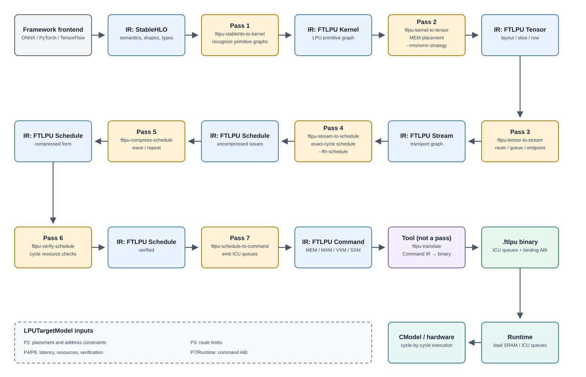
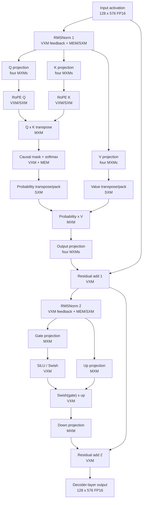

# FTLPU Compiler Architecture

[English](compiler_architecture.md) | [简体中文](compiler_architecture.zh-CN.md)

This document fixes the compiler split for the first LPU backend work:

```text
ONNX / PyTorch / TensorFlow
  -> StableHLO
  -> FTLPU kernel IR
  -> FTLPU tensor IR
  -> FTLPU stream IR
  -> FTLPU schedule IR
  -> FTLPU command IR
  -> .ftlpu binary
  -> runtime / CModel / hardware
```

## Pass pipeline and IR boundaries



Nodes labeled “Pass” are the actual MLIR pass arguments returned by `getArgument()`. Files such as `AttentionToTensor.cpp`, `FfnToStream.cpp`, and the Schedule emitter modules are operation-specific lowerers called inside Pass 2, Pass 3, or Pass 4; they are not separately scheduled MLIR passes. Schedule compression and verification retain Schedule IR and transform or validate it in place. `ftlpu-translate` is a serializer from Command IR to `.ftlpu`, not a pass.

| Requested stop point | `ftlpu-opt --pipeline` | Ordered pass expansion |
| --- | --- | --- |
| Kernel IR | `ftlpu-stablehlo-to-kernel` | P1 |
| Tensor IR | `ftlpu-stablehlo-to-tensor` | P1 → P2 |
| Stream IR | `ftlpu-stablehlo-to-stream` | P1 → P2 → P3 |
| Verified Schedule IR | `ftlpu-stablehlo-to-schedule` | P1 → P2 → P3 → P4 → P5 → P6 |
| Command IR | `ftlpu-stablehlo-to-commands` | P1 → P2 → P3 → P4 → P5 → P6 → P7 |
| Command IR from Schedule input | `ftlpu-schedule-to-commands` | P5 → P6 → P7 |

StableHLO is the primary frontend/common model IR boundary. IREE is a reference compiler framework and a comparison tool, not the IR that the LPU backend must permanently depend on.

The composite pipeline names in the table are driver selections rather than additional passes. The decoder-layer runtime flow can stop at any intermediate IR for testing; its complete path reaches Command IR through P7 and then invokes `ftlpu-translate` to write the binary.

The repository does not currently contain a frontend-generated `forward.mlir`. The decoder test starts from `compiler/examples/smollm2_135m_decoder_layer/decoder_layer_seq128.stablehlo.mlir`; the Hugging Face importer supplies real weights and golden data, not automatic graph export.

## Responsibilities

### StableHLO Boundary

StableHLO should represent frontend model semantics after framework import:

- matmul and batched matmul as `stablehlo.dot_general`;
- convolution as `stablehlo.convolution`;
- elementwise and activation ops as StableHLO arithmetic;
- explicit tensor shapes, element types, and broadcast semantics.

This boundary keeps the LPU compiler independent from ONNX, PyTorch, and TensorFlow graph quirks.

### FTLPU Kernel IR

The kernel IR is the first FTLPU-owned compiler layer. It should:

- normalize StableHLO ops into a small LPU-oriented kernel set;
- map each kernel to concrete LPU functional units such as MXM and VXM;
- represent reusable computation primitives including `matmul`, `batch_matmul`, `rope`, `softmax`, `transpose`, `swish`, and elementwise operations;
- validate static shapes and element types supported by the LPU;
- preserve quantization and layout metadata explicitly.

FFN and attention are graphs of these primitives in the public Kernel IR, not opaque operations. Fusion is a later optimization decision. Attention remains a primitive graph through the Kernel-to-Tensor boundary: `kernel::AttentionGraph` recognizes and validates the Q/K/V projection, RoPE, QK, softmax, PV, and output-projection SSA subgraph, and Kernel-to-Tensor assigns its physical memory plan directly. There is no `ftlpu.kernel.attention` compatibility operation. FFN uses the same design: `kernel::FfnGraph` recognizes the gate/up projections, Swish, multiply, and down projection, and Kernel-to-Tensor lowers that graph directly. The former `ftlpu-compose-kernel-plans`, `ftlpu.kernel.ffn`, and `ftlpu.tensor.ffn` compatibility path has been removed.

#### Kernel-to-Tensor implementation layout

The Kernel-to-Tensor pass is organized as an orchestration layer plus operation-specific lowerers:

- `KernelToTensor.cpp` discovers primitive graphs, computes SSA last-use information, allocates ordinary function inputs, and dispatches lowering;
- `AttentionToTensor.cpp` owns Attention graph memory planning and task emission;
- `FfnToTensor.cpp` owns FFN graph memory planning and task emission;
- `MatmulToTensor.cpp` and `SwigluToTensor.cpp` lower standalone primitives;
- `KernelToTensorLowering.{hpp,cpp}` contains the shared row allocator, placement builders, and lowering interfaces.

The lowerers return `LogicalResult` and emit diagnostics on their root operation. They do not own pass failure state. This keeps graph-specific policy out of the pass driver and allows each lowering to be tested and evolved independently.

### FTLPU Tensor IR

The tensor IR owns MEM allocation and tensor placement:

- assign activation, weight, intermediate, and output tensors to MEM ranges;
- choose MEM columns/banks and base addresses;
- describe tile plans that reference the selected kernels;
- keep layouts and element sizes explicit.

The implemented `ftlpu.tensor.matmul` and `ftlpu.tensor.swiglu` operations use the physical rank-6 MEM address tuple `[device, hemisphere, slice, bank, word, byte]`. The shared `FTLPU-CMODEL/config/ftlpu-lpu32.json` target has 52 slices per hemisphere and two 8192-row, 32-byte SRAM banks per slice: 512 KiB per slice, 26 MiB per hemisphere, and 52 MiB across both hemispheres. Compiler profile JSON files contain scheduling or placement overlays only; physical SRAM and MXM accumulator capacities come from the shared hardware JSON. Allocation uses role-specific east-hemisphere SRAM row pools. Function inputs are live at entry, each SSA tensor is kept through its last use, and expired row ranges are merged and reused with a first-fit policy. Output storage is allocated before current operands expire, so a functional unit cannot overwrite an input that it is still consuming.

Matmul placement also carries CModel-facing row geometry. The generic standalone matmul path uses `mxm_weight_striped` across MEM slices 0 through 15, `vector` activation placement beginning at slice 32, and four `int32_byte_planar` result slices 40 through 43. These values describe the generic matmul allocator, not the current W8A16 SmolLM2 decoder profile below. Each placement records its slice list, base SRAM row, instruction count, and signed address stride. The generic CModel matmul convention uses a 16-row stride; weight Read commands walk the rows in reverse order. FFN is represented as a primitive physical task graph: two `ftlpu.tensor.matmul_task` projections, `ftlpu.tensor.swish_task`, `ftlpu.tensor.elementwise_task`, and one down-projection matmul task. Each matmul carries allocation lists for its operands and result. An empty result list means that the value remains transient in an MXM accumulator or stream. The elementwise result owns two allocations so the hidden tensor can be materialized independently in the west and east hemispheres; the down projection consumes both allocations. Addresses, placements, byte sizes, and quantization parameters are therefore attached to the primitive operation that uses them instead of being hidden in a compound `ftlpu.tensor.ffn`.

Attention is also a primitive Tensor SSA graph. Query, key, value, and output projections are `projection_task` operations; RoPE, QK/PV batch matmul, softmax, and probability/value transpose are separate task operations. The physical memory plan is partitioned into disjoint task-local dictionaries, so each of its 22 named buffers has exactly one owner. Tensor-to-Stream validates the complete producer graph and reconstructs a read-only aggregate view when allocating routes. The obsolete compound `ftlpu.tensor.attention` operation has been removed.

#### Address-planning boundary

Compiler address planning produces a physical binding template for one function or operator graph; it does not globally place every layer's constants. The scopes are:

| Scope | Owner | Algorithm / contract |
| --- | --- | --- |
| Ordinary SSA values | `FunctionMemoryPlanner` + `RowAllocator` | Number operations, compute each value's last use, first-fit a role-specific row pool, release expired non-external allocations, and merge adjacent free intervals |
| Attention scratch | `PhysicalMemoryAllocator` | Allocate a contiguous window from ordered candidate slices; conflict requires overlapping half-open lifetimes plus a common slice and overlapping rows, unless either allocation reserves the whole slice port |
| Operator profiles | RMSNorm, Attention, and W8A16 FFN lowerers | Choose target-derived slice groups and fixed row regions required by the hardware data path |
| Whole-model residents and state | Runtime `SessionMemoryPlanner` | Preserve compiler layout/slices/shape and relocate only `base_row` across invocations |
| Cycle resources | `ResourceScheduler` and Schedule verifier | Check MEM queues, ports, streams, functional units, and transport latency after spatial placement |

For ordinary values, output storage is allocated before current operands expire, so output cannot alias an input that the operation is still consuming. Allocations explicitly bound by a specialized profile are marked externally managed and are not returned to the generic row pool. Compiler binaries also publish conservative per-slice memory floors because anonymous command scratch is not represented by ordinary input/output bindings.

The compiler therefore owns layout legality, slice selection, row span, signed address stride, operator scratch, and relocation metadata. Runtime may move a relocatable resident binding to a different common `base_row` on the same ABI/hemisphere/slices, but it may not silently change layout or slice topology. The package-wide algorithm is documented in [Address planning and relocation](../../runtime/docs/model_package.md#address-planning-and-relocation).

#### Current SmolLM2-135M decoder-layer profile

The complete decoder-layer test uses a hand-authored Standard StableHLO function with sequence length 128, hidden size 576, 9 query heads, 3 KV heads, head dimension 64, and an FFN hidden size of 1536. Its current computation graph is:



RoPE is a separate task in the public primitive graph, but the Schedule planners execute it as soon as the corresponding Q or K projection block is available. It is not forced to wait until the complete Q and K tensors have been materialized.

Each Q/K/V projection groups two logical heads at a time. The east hemisphere handles the first head and the west hemisphere handles the second. Within each hemisphere, its two local MXMs compute the two 32-column halves of the 64-element head, so all four physical MXMs run concurrently for a full two-head group. The loop then walks 18 hidden-dimension reduction blocks (`576 / 32`) and four token blocks (`128 / 32`); the final odd Q or KV head uses only the east pair. Weight buffers are reused across the four token blocks before advancing to the next weight tile.

The current W8A16 decoder instantiates the scopes above: target-derived slice sets and specialized fixed row regions are selected at compile time, followed by runtime `base_row` relocation for resident data. The tables below describe the shared 8192-row hardware target; resident variants may use different target-selected slice sets while preserving the same layout contract.

The persistent distributed activation ABI uses two 16-slice groups. Slice numbers below are local to each hemisphere, and the order is the current physical lane order:

| Logical value | Slice group | Base row | Layout |
| --- | --- | ---: | --- |
| Layer input | A = `36,37,38,39,40,41,42,43,44,45,46,47,48,49,50,51` | 4096 | `fp16_mxm_distributed_16` |
| RMSNorm 1 result | A | 5632 | `fp16_mxm_distributed_16` |
| Attention residual | B = `0,1,2,3,4,5,6,7,8,9,10,11,12,13,14,15` | 4096 | `fp16_mxm_distributed_16` |
| RMSNorm 2 result | A | 5632 | `fp16_mxm_distributed_16` |
| Layer output | A | 4096 | `fp16_mxm_distributed_16` |

The `vxm-feedback` RMSNorm profile uses base row 4608 for transposed feedback scratch, gamma vectors beginning at row 5120 (row 5192 for the second norm in this shape), and row 5632 for normalized scratch and the final MXM-oriented result. Scratch slice groups are chosen disjoint from live input/result groups. The current schedule contains `rmsnorm.transpose_input`, `rmsnorm.feedback`, and `rmsnorm.restore_layout` timelines. The final FP32-to-FP16 VXM step writes east and west copies; `restore_layout` repairs VXM-to-MXM element ordering rather than performing hemisphere replication.

Attention weights use W8A16 striped layouts:

| Weight | Base row | Instruction count | Local slices |
| --- | ---: | ---: | --- |
| Q | 0 | 720 | `0,4,8,12,16,20,24,28` |
| K | 720 | 288 | `0,4,8,12,16,20,24,28` |
| V | 1008 | 288 | `0,4,8,12,16,20,24,28` |
| Output projection | 1296 | 648 | `0,4,8,12,2,18,24,28` |

The main Attention scratch regions are Q/IW at row 7600, K at row 0, packed V at row 7800, the RoPE table at row 7000, QK/softmax score planes at row 3000, probability pack at row 6000, causal-mask tiles at row 8128, and context at row 2000. Block8 targets also allocate a target-selected 16-slice Q/K-to-RoPE staging FIFO, a distributed O-projection activation range after the input range, and a non-overlapping distributed result range. The staging FIFO uses disjoint addresses for projection kind, head, half, token block, and Block8 row; half 1 rotates its physical slice mapping by two lanes so both RoPE operands can be read in one cycle. Legacy Vector targets retain the four-slice planar result. Equal row numbers are legal when slice sets or logical lifetimes are disjoint.

The FFN places gate, up, and down weights at base rows 10000, 11728, and 13456 on eight W8A16 striped slices. Gate/up FP32 results remain transient in MXM accumulators or streams. The fused FP16 hidden value is written at the target-configured row 8192 using four independent target-selected local slices (`21,22,23,31` for the current profile), split across the two hemispheres. The down-projection result uses result slices 24 through 27 before the final residual writes the persistent distributed-16 output.

The Hugging Face SmolLM2-135M/Instruct checkpoint is not itself an INT8 model. The importer reads the BF16 checkpoint and applies symmetric per-tensor INT8 quantization to linear weights; activations remain 16-bit, so this is a W8A16 compiled profile.

Thirty structurally identical layers do not require thirty independently stored command programs. The current resident package uses five slice-placement executable variants, reuses each variant for six layers, and relocates 270 layer constants. `ModelSession::load` uploads those constants once; the 30 invocations then run without host weight traffic. The 52-slice target provides 208 MiB total SRAM and the current full-model prefill path has been exercised through 30 decoder invocations, final RMSNorm, and the tied LM head. See the [runtime model-package document](../../runtime/docs/model_package.md) for the measured golden results and resident allocator contract.

Prefill and token decode should be separate shape-specialized compilations: prefill schedules large M tiles and constructs the initial KV cache, while decode schedules M=1 (or a small token batch) and reads/extends persistent KV state. The current end-to-end compiled decoder stack is the sequence-length-128 prefill path; persistent KV state and relocation support exist, but a complete token-decode executable is not yet documented as implemented. The resident target uses a 2048-token KV profile. An 8192-token BF16 KV cache alone is about 180 MiB, so longer contexts need paged or off-chip KV storage.

### FTLPU Stream IR

The stream IR maps MEM-resident tensor tiles onto LPU streams:

- every stream has a source and sink, such as `MEM:A -> MXM0:lhs`;
- every stream records a direction-local contiguous stream range and stream register id;
- every stream records start address, byte count, and endpoint functional unit;
- MXM/VXM post-processing streams are explicit instead of implied by kernels.
- streams are long logical vectors when the instruction naturally traverses the south-to-north tile chain; the compiler should not expand those 20 physical tiles into separate IR ops.

This layer is conceptually similar to IREE Stream, but it is FTLPU-owned and should model the real LPU data movement directly.

The implemented `ftlpu.stream.route` operation records a direction-local contiguous `[stream_base, stream_base + stream_count)` range, a physical MEM-boundary `register_id`, source/destination endpoints, explicit source/destination functional-unit ids, MEM address, byte count, and fixed transport latency. MEM endpoints use unit id `-1`; MXM endpoints identify MXM0 or MXM1. `ftlpu.stream.matmul` also records the selected MXM unit and weight-buffer id. Each `ftlpu.tensor.matmul` becomes two eastbound MEM-to-MXM routes, one `ftlpu.stream.matmul`, and one westbound MXM-to-MEM route. The MXM weight route owns 16 streams during IW load, activation compute consumes one stream, and each int32 result owns four consecutive byte streams.

SSA operation order is used internally by the stream allocator to permit safe stream-range reuse, but no logical lifetime stage is emitted in Stream IR. Exact issue and arrival cycles are assigned by Stream-to-Schedule.

FFN is also primitive in public Stream IR. Gate and up are separate `ftlpu.stream.matmul_task` operations fed by one shared activation route and independent dequantized weight routes. `swish_task` and an `elementwise_task` with `kind = "multiply"` expose the VXM dataflow and the two west/east hidden allocations. Two hidden MEM-to-MXM routes then feed separate down matmul tasks. A final `elementwise_task` with `kind = "add_quant"` merges their partials and owns the result allocation. Each matmul task explicitly records its MXM unit, weight buffer, and result stream range. The current Stream-to-Schedule implementation composes this graph into its established scheduling descriptor internally; the compound operation is not emitted by the StableHLO-to-Stream pipeline.

Attention is likewise an SSA-connected primitive graph: query/key/value `projection_task` operations feed two `rope_task` operations, then a QK `batch_matmul_task`, `softmax_task`, probability/value `transpose_task` operations, a PV `batch_matmul_task`, and the output `projection_task`. Routes are partitioned onto the task that owns each transfer instead of being copied as one global array onto every projection. The output projection owns the shared physical memory plan, and the Schedule analysis collects and validates the complete graph before assigning exact cycles. The obsolete compound `ftlpu.stream.attention` operation is not part of public Stream IR.

#### Tensor-to-Stream implementation layout

`TensorToStream.cpp` is now only a pass driver: it collects validated task graphs, owns the shared stream allocator, dispatches lowerers, and rejects any unhandled Tensor task. Operation-specific materialization lives in `AttentionToStream.cpp`, `FfnToStream.cpp`, `MatmulToStream.cpp`, and `SwigluToStream.cpp`.

Tensor and Stream Attention use the same templated graph view and topology matcher. Their layer-specific wrappers only aggregate physical memory plans or routes. Attention route lifetimes are produced by `StreamRoutePlan`; the materializer allocates those planned routes and emits MLIR without embedding a second lifetime table.

Physical Attention slice sets and SRAM rows are selected through `LPUTargetModel` layout-policy methods. Lowering code no longer carries literal slice lists or row addresses, and weight geometry uses the configured lane and MXM parameters.

### Schedule planning and emission

Stream-to-Schedule is split into a target-independent planning side and an MLIR emission side. `SchedulePlan` is the common task DAG. Each task has a stable id and name, functional kind, model stage, earliest cycle, duration, resource windows, and producer dependencies with fixed transport latency. The plan validates duplicate names, invalid edges, and dependency cycles before `ResourceScheduler` assigns exact cycles.

Attention owns separate Projection, RoPE, Softmax, PV, and OutputProjection stage planners and emitters. The planner constructs projection work, QK/PV waves, and the five-stage DAG without an `IRRewriter`. The stage emitters consume that immutable plan and only create Schedule IR. RoPE remains fused with each completed Q/K projection block, even though its planner and emitter are separate modules. Attention physical memory layout is an Analysis object. The Softmax planner reserves its VXM and MEM windows and returns the exact cycle of every wave and hemisphere; the Softmax emitter no longer owns a resource scheduler.

FFN uses reusable WeightLoad, Projection, Swish, and DownProjection schedule builders. Gate/Up and Down share one weight dequantization and MXM-load emitter. The six-cycle Swish ALU sequence is an independently testable emitter, while `FfnSwishPlanner` schedules its VXM/MEM windows around weight dequantization and temporary-memory traffic. The FFN MLIR emitter consumes those planned cycles and does not invoke `ResourceScheduler`. `FfnProjectionTimeline` and `FfnDownProjectionTimeline` additionally describe every reduction block, ping-pong weight buffer, M-tile compute cycle, and activation-stream segment used while prefetching the next weight tile. These timelines are derived from `LPUTargetModel`; changing tile, lane, MXM, hemisphere, or stream counts does not require editing the emitter. The obsolete compound `ftlpu.stream.ffn` and `ftlpu.stream.attention` operations have been removed; public Stream IR contains only primitive task and route operations.

### LPU Target Model

`LPUTargetModel` is the single compiler-side source for MEM geometry, 32 compute streams per direction, the 64 packed selectors, the separate C2C lane count and bytes-per-lane throughput, MEM-boundary register columns, the additional SXM-to-MXM column, MXM dimensions and throughput, supported endpoint routes, register mapping, and transport latency. A latency means producer issue to consumer visibility, including the CModel tick phase; lowering passes must query the model instead of embedding compensating cycles.

#### Automatic MXM execution strategy

`MxmExecutionStrategyPlanner` selects an execution strategy from tensor types, matrix dimensions, result-placement requirements, and `LPUTargetModel` capabilities. For a legal BF16-activation/INT8-weight projection, it atomically selects `Int8DequantBF16` weight input and `Block8` compute. The schedule then uses eight raw INT8 weight streams, local MXM dequantization, sixteen distributed BF16 activation streams, and four eight-row compute issues for each 32-row output block. If any capability, type, alignment, stream-width, or accumulator-placement requirement is not met, the planner selects the complete legacy VXM-dequant/Direct16/Vector strategy; it never creates an unsupported hybrid.

The relevant target parameters are `mxm_int8_load_streams_per_cycle`, `mxm_block_rows`, `mxm_local_dequant_enabled`, `mxm_block_compute_enabled`, `mxm_local_load_to_compute_latency`, and `mxm_block_group_interval`. They are part of target ABI schema 7 and therefore participate in compiler/runtime compatibility hashing.

`mxm_block_compute_enabled` is a hardware capability bit. `--mxm-execution auto|legacy|block8` is only a compiler policy: `auto` may select Block8 when the target and operation are legal, `legacy` suppresses it, and `block8` requires it but cannot enable it on an unsupported target.

The generic W8A16 linear-projection path, FFN, and Attention projections consume this strategy. Attention maps Q/K/V and O projection to local INT8 dequant plus Block8 compute, while activation-by-activation QK and PV remain on Vector compute. Two 32-column projection halves use separate weight buffers and alternate four-cycle Block8 issues. Wavefront IW replaces a weight column only after the preceding compute has consumed it, so dequant/load overlaps compute without corrupting an in-flight tile. The final partial uses the MXM accumulator's BF16 `stream + clear` path. Q/K write the 16 westbound MXM result streams to the MEM staging FIFO, from which RoPE drains at one token per cycle while the next MXM projection runs; its VXM results use east streams 20..23 to avoid the concurrent MXM producer streams. Query RoPE writes directly into the hemisphere of the shared KV head, eliminating the former post-projection VXM pass. V writes directly to its distributed16 placement. PV context is converted once to a reusable distributed16 O-projection input, and the O result remains distributed16 for residual/RMSNorm consumers. O projection runs both hemispheres concurrently, ping-pongs the singleton output group across duplicated weight buffers, overlaps pair prefetch with result writeback, and writes each Block8 result directly to its source-local shard. On the SmolLM2-135M seq_len=128 Attention baseline, the complete schedule drops from 127,907 to 38,215 cycles (70.12%) while the CModel numerical baseline passes for Q/K/V+RoPE, causal softmax, PV, and O projection. A 32x64x64 projection completes with exact BF16 agreement in 136 scheduled cycles versus 195 for the legacy strategy. A real SmolLM2-135M 4096-column LM-head shard completes in 44,544 scheduled cycles versus 83,136, a 46.42% reduction, with exact CModel agreement.

Feedback RMSNorm has its own Tensor/Stream/Schedule lowering. Its Schedule emitter coordinates distributed MEM reads, SXM permutations, VXM reduction and feedback, the final FP32-to-FP16 cast, east/west writes, and the optional VXM-to-MXM layout restoration. This is separate from the older `vxm-square-mxm-reduce` strategy and is selected by `--rmsnorm-strategy vxm-feedback` in the decoder-layer runtime test.

The target is configurable during architecture exploration:

```text
ftlpu_opt --target-config compiler/examples/targets/exploration_40_streams.json ...
```

The JSON file may override fields in the `memory`, `streams`, and `throughput` sections. Unspecified fields retain the default CModel-compatible values. The resolved configuration is serialized into the module as the `ftlpu.target` dictionary, so every intermediate MLIR file carries the parameters needed to reproduce later lowering. Kernel-to-Tensor, Tensor-to-Stream, and Stream-to-Schedule recover the model from that attribute. Configuration validation rejects non-positive dimensions, stream widths that exceed the directional fabric, invalid MEM slice bases, and incompatible tile geometry.

Binary format v16 embeds the complete resolved hardware configuration instead of only a target name and ABI hash. Every CModel end-to-end test passes an explicit `--target-config`; the runtime verifies that the embedded fields reproduce the ABI before loading ICU queues. The CModel static library is a physical-capacity build and each `TspSliceSystem` selects a logical configuration at load time. It currently adapts SRAM depth, one or two MXMs per hemisphere, MXM weight-buffer count, VXM ALU count, and the Block8/local-dequant/transport-overlap capability bits. Queue indices are mapped from the executable's logical MXM topology onto the physical topology.

Structural ISA and timing fields, including stream count, tile geometry, matrix dimensions, transport width, and fixed latency, must still exactly match the CModel implementation. Capacity requests must be nonzero and no larger than the physical model. `exploration_40_streams.json` therefore remains a compiler scheduling regression: it lowers to a different Schedule IR, but the default 32-stream CModel rejects its binary with a field-specific compatibility error. A new physical CModel implementation is required before such a structural exploration target can execute.

### FTLPU Schedule IR

The schedule IR is the low-level scheduled target:

- explicit cycle numbers;
- explicit MEM/MXM/VXM queues;
- explicit NOP and repeat opportunities;
- stage-level operations first, such as `mem_read_weight`, `mem_read_activation`, `mxm_load`, `mxm_compute`, and `mem_write`; queue command expansion belongs in the Command lowering layer.

The implemented Schedule dialect uses `ftlpu.schedule.mem_read`, `ftlpu.schedule.mxm_load`, `ftlpu.schedule.mxm_compute`, and `ftlpu.schedule.mem_write`. Every operation carries an ICU issue `cycle` and `duration`. The scheduler reserves each MEM slice queue, each direction-local stream, the selected MXM unit's load/compute queues, and its selected weight buffer. `mxm_load` and `mxm_compute` preserve both ids explicitly. Fixed transport latency is included between producer and consumer windows, and SSA consumers cannot read a value before its producer's MEM write completes.

Attention no longer emits a compound `ftlpu.schedule.attention` operation. Its hardware program consists only of the same MEM/MXM/VXM/SXM primitive schedule operations used by other workloads. Generic `ftlpu.schedule.binding` operations preserve runtime-visible inputs, outputs, and internal constants; generic `ftlpu.schedule.timeline` operations retain the six named phase intervals for inspection and visualization. Schedule-to-Command translates bindings without any Attention-specific branch. Detailed projection and QK/PV work-wave plans remain compiler analysis objects covered by planner tests instead of being duplicated into executable IR.

For the current 320x320 int8 GEMM, the CModel-aligned baseline is: weight MEM reads begin at cycles 5 through 8 according to their MEM boundary, IW runs at `[18,38)`, activation MEM Read on `E16` runs at `[33,353)`, Compute issue runs at `[38,358)`, the first MXM result appears at cycle 57, and four int32 byte-plane MEM writes run at `[59,379)`. The output stream remains occupied for the full 339-cycle MXM result window while the 20 physical tile rows drain.

For the 160x320x640x320 FFN fixture, shared activation startup follows the CModel path in three segments (`E16`, `E30`, `E0`) for both hidden passes. The correctness-first schedule computes pass 0 at cycles 58/73/77 and pass 1 at 318/333/337. Twelve stream-register transport cycles separate the first MXM result from VXM consumption. The two SwiGLU pipelines start at cycles 89 and 349 and write 160 i8 rows to slices 40 and 41 at cycles 110 and 370. Down weights load into buffer 0 at cycles 538 and 558; both MXMs compute at cycle 590 from activation streams `E0` and `E16`. The six-stage VXM AddQuant starts at cycle 621 and writes the final slice-42 result at cycle 638. This schedule is deliberately serial; buffer-1 ping-pong is a separate performance optimization.

### FTLPU Command IR

Command IR is the stable compiler/runtime boundary. The `ftlpu-schedule-to-command` pass removes the Schedule SSA graph and emits `ftlpu.command.binding`, `ftlpu.command.mem`, `ftlpu.command.mxm`, `ftlpu.command.vxm`, `ftlpu.command.sxm`, and `ftlpu.command.loop` operations. Bindings describe input/output index, shape, element type, byte size, and physical placement. Results are represented by bindings plus their physical MEM write commands instead of an SSA tensor return value.

A functional command maps to an ICU queue instruction plus optional single-instruction Repeat. `ftlpu.command.loop` is the multi-instruction form: it replays the preceding contiguous window of up to 63 functional instructions for up to 255 additional rounds, with a round-start interval and optional MEM address stride. The runtime loads the 32-bit Loop control word without host-side expansion; the queue-local ICU frontend replays the window. A 320x320 GEMM produces 16 weight MEM commands, one activation MEM command, four result MEM commands, one IW command, and one Compute command. VXM commands carry ALU opcode, typed stream/ALU/immediate operands, cast target, output stream, and repeat metadata. Command operations are explicitly side-effecting so MLIR canonicalization cannot remove hardware work. Binary emission groups the flat command stream by queue and derives queue-local NOP counts from absolute cycles without reconstructing scheduling decisions.

`ftlpu-translate` serializes this layer to `.ftlpu` binary version 2. The runtime stages bound inputs into SRAM, loads every ICU queue before clocks start, advances `TspSliceSystem::tick()`, and reconstructs bound outputs. The 320x320 regression compares all 102,400 int32 results against a CPU GEMM.

### Test Artifacts

Compiler tests keep generated IR under a directory named after the test:

```text
build-ftlpu-vs2026/compiler/ftlpu_lower/<test-name>/
```

The complete FFN lowering test preserves every visible boundary as `ffn.stablehlo.mlir`, `ffn.kernel.mlir`, `ffn.tensor.mlir`, `ffn.stream.mlir`, `ffn.schedule.mlir`, and `ffn.commands.mlir`. Runtime tests use a different directory and additionally produce `ffn.ftlpu`, so parallel or repeated tests cannot overwrite another test's artifacts.

## Role Of IREE

IREE remains useful because it shows mature MLIR compiler engineering patterns:

- frontend import boundaries;
- Flow dispatch formation;
- Stream-style scheduling and resource modeling;
- pass pipeline organization;
- out-of-tree target/backend plugin structure.

The repository may keep tests that use IREE as a reference path:

```text
ONNX -> IREE importer -> IREE Flow IR
```

Those tests are comparison and sanity tests. The main backend path should be:

```text
StableHLO -> FTLPU kernel IR -> FTLPU tensor IR -> FTLPU stream IR
          -> FTLPU schedule IR -> FTLPU command IR
```

## Immediate Milestones

1. Keep ONNX-to-IREE Flow tests as reference coverage.
2. Add StableHLO fixture tests for matmul and elementwise ops.
3. Define textual `ftlpu.kernel`, `ftlpu.tensor`, and `ftlpu.stream` examples.
4. Lower StableHLO matmul to MXM kernel, MEM allocation, and explicit stream form.
5. Lower StableHLO/FTLPU Kernel FFN SwiGLU to the CModel-aligned schedule shape.
6. Lower FTLPU stream/schedule programs to `.ftlpu`.
