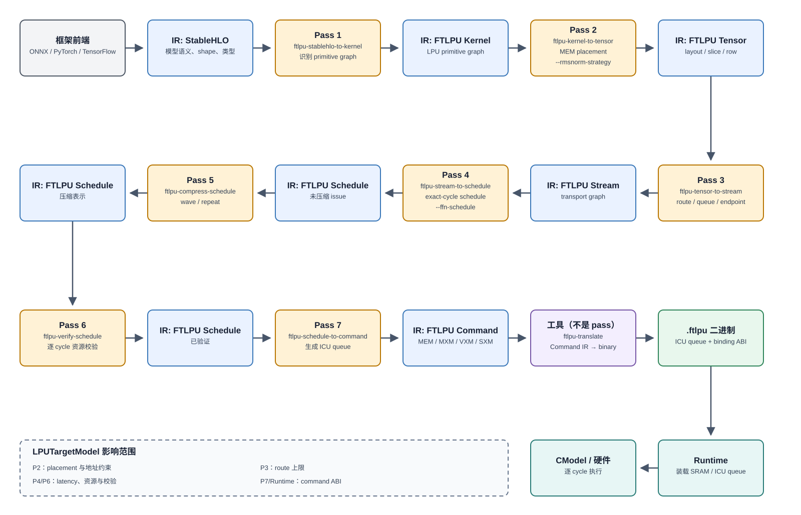
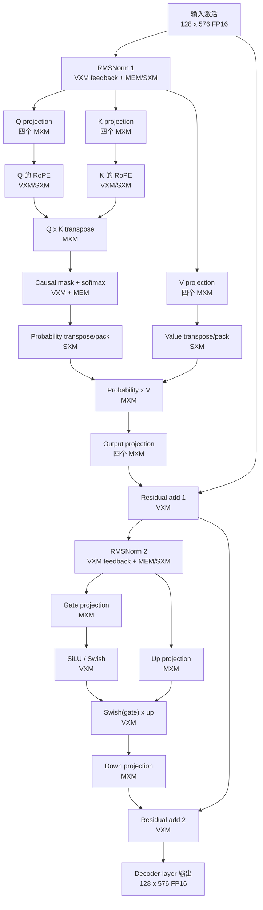

# FTLPU 编译器架构

[English](compiler_architecture.md) | [简体中文](compiler_architecture.zh-CN.md)

本文确定第一阶段 LPU 后端的编译器分层：

```text
ONNX / PyTorch / TensorFlow
  -> StableHLO
  -> FTLPU kernel IR
  -> FTLPU tensor IR
  -> FTLPU stream IR
  -> FTLPU schedule IR
  -> FTLPU command IR
  -> .ftlpu 二进制
  -> runtime / CModel / 硬件
```

## Pass pipeline 与 IR 边界



图中标为“Pass”的节点对应 `getArgument()` 返回的实际 MLIR pass 名称。`AttentionToTensor.cpp`、`FfnToStream.cpp` 和各 Schedule emitter 是 Pass 2、Pass 3 或 Pass 4 内部按算子分派的 lowerer，不是单独加入 pass manager 的 MLIR pass。Schedule compression 和 verification 仍在 Schedule IR 内原地变换或校验；`ftlpu-translate` 是从 Command IR 到 `.ftlpu` 的序列化工具，不是 pass。

| 需要停留的产物 | `ftlpu-opt --pipeline` | 实际 pass 顺序 |
| --- | --- | --- |
| Kernel IR | `ftlpu-stablehlo-to-kernel` | P1 |
| Tensor IR | `ftlpu-stablehlo-to-tensor` | P1 → P2 |
| Stream IR | `ftlpu-stablehlo-to-stream` | P1 → P2 → P3 |
| 已验证的 Schedule IR | `ftlpu-stablehlo-to-schedule` | P1 → P2 → P3 → P4 → P5 → P6 |
| Command IR | `ftlpu-stablehlo-to-commands` | P1 → P2 → P3 → P4 → P5 → P6 → P7 |
| 从 Schedule IR 生成 Command IR | `ftlpu-schedule-to-commands` | P5 → P6 → P7 |

StableHLO 是主要的前端/共同模型 IR 边界。IREE 是参考编译器框架和对比工具，不是 LPU 后端必须永久依赖的 IR。

## 各层职责

表中的组合 pipeline 名称只是 driver 选择，不是额外 pass。decoder-layer runtime 流程可以停在任意中间 IR 做测试；完整路径通过 P7 到达 Command IR，再调用 `ftlpu-translate` 写出二进制。

当前仓库中没有由前端自动导出的 `forward.mlir`。decoder 测试从 `compiler/examples/smollm2_135m_decoder_layer/decoder_layer_seq128.stablehlo.mlir` 开始；Hugging Face importer 提供真实权重和 golden 数据，但不负责自动导出计算图。

### StableHLO 边界

StableHLO 表达框架导入后的前端模型语义：

- matmul 和 batched matmul 表达为 `stablehlo.dot_general`；
- convolution 表达为 `stablehlo.convolution`；
- elementwise 和 activation 使用 StableHLO 算术操作；
- 显式记录 tensor shape、元素类型和 broadcast 语义。

该边界让 LPU 编译器不受 ONNX、PyTorch 和 TensorFlow 图格式差异影响。

### FTLPU Kernel IR

Kernel IR 是第一层由 FTLPU 自有的编译器 IR，负责：

- 把 StableHLO op 规范化为小规模、面向 LPU 的 kernel 集合；
- 将每个 kernel 映射到 MXM、VXM 等具体 LPU 功能单元；
- 使用可复用的 `matmul`、`batch_matmul`、`rope`、`softmax`、`transpose`、`swish` 和 elementwise 等计算原语；
- 验证 LPU 支持的静态 shape 和元素类型；
- 显式保留 quantization 与 layout 元数据。

公开的 Kernel IR 使用这些原语组成 FFN 和 Attention 图，不再把两者表示成不可拆分的大 op。融合由后续优化 pass 决定。Attention 现在以 primitive graph 直接跨过 Kernel-to-Tensor 边界：`kernel::AttentionGraph` 负责识别并校验 Q/K/V projection、RoPE、QK、softmax、PV 和 output projection 组成的 SSA 子图，Kernel-to-Tensor 直接为该图分配物理内存，不再生成 `ftlpu.kernel.attention` 兼容 op。FFN 采用相同设计：`kernel::FfnGraph` 识别 gate/up projection、Swish、multiply 和 down projection，Kernel-to-Tensor 直接 lower 该图。原有 `ftlpu-compose-kernel-plans`、`ftlpu.kernel.ffn` 和 `ftlpu.tensor.ffn` 兼容路径均已删除。

#### Kernel-to-Tensor 实现结构

Kernel-to-Tensor pass 由编排层和按计算类型拆分的 lowering 模块组成：

- `KernelToTensor.cpp` 负责识别 primitive graph、计算 SSA last-use、分配普通函数输入，并分派 lowering；
- `AttentionToTensor.cpp` 负责 Attention 图的物理内存规划和 task 生成；
- `FfnToTensor.cpp` 负责 FFN 图的物理内存规划和 task 生成；
- `MatmulToTensor.cpp` 和 `SwigluToTensor.cpp` 负责独立 primitive；
- `KernelToTensorLowering.{hpp,cpp}` 提供共享的 row allocator、placement builder 和 lowering 接口。

各 lowerer 返回 `LogicalResult`，并在根 op 上输出诊断，但不直接控制 pass 失败状态。这样图相关策略不会重新堆积到 pass driver 中，各类 lowering 也可以独立测试和演进。

### FTLPU Tensor IR

Tensor IR 负责 MEM 分配和 tensor 放置：

- 为 activation、weight、intermediate 和 output 分配 MEM 范围；
- 选择 MEM column/bank 和基础地址；
- 描述引用已选 kernel 的 tile plan；
- 显式记录 layout 和元素大小。

已实现的 `ftlpu.tensor.matmul` 和 `ftlpu.tensor.swiglu` 使用物理 rank-6 MEM 地址元组 `[device, hemisphere, slice, bank, word, byte]`。共享的 `FTLPU-CMODEL/config/ftlpu-lpu32.json` target 每个 hemisphere 包含52个 slice，每个 slice 有两个8192-row、32-byte 的 SRAM bank：每 slice 512 KiB、每 hemisphere 26 MiB、东西半球共52 MiB。compiler profile JSON 只保存调度或 placement 覆盖项，物理 SRAM 和 MXM accumulator 容量统一来自共享硬件 JSON。分配器按 tensor role 使用 east hemisphere 的 SRAM row pool。函数输入在入口处存活，每个 SSA tensor 保留到最后一次使用；失效的 row range 会合并并通过 first-fit 策略复用。当前 operand 失效之前先分配 output，避免功能单元覆盖仍在读取的输入。

Matmul placement 同时记录 CModel 所需的 row geometry。通用独立 matmul 路径的 MXM weight 采用 `mxm_weight_striped`，分布在 MEM slice 0..15；activation 使用从 slice 32 开始的 `vector` placement；int32 result 使用 slice 40..43 上的四个 `int32_byte_planar` plane。这些数值描述通用 matmul allocator，不代表下文当前 W8A16 SmolLM2 decoder profile。每个 placement 记录 slice 列表、基础 SRAM row、指令数和有符号地址 stride。通用 CModel matmul 约定 stride 为 16 row；weight Read 命令反向遍历 row。

FFN 在这一层表示为通用的物理 task 图：两个 `ftlpu.tensor.matmul_task` projection、一个 `ftlpu.tensor.swish_task`、一个 `ftlpu.tensor.elementwise_task` 和一个 down projection matmul task。每个 matmul 分别记录 operand 和 result 的 allocation 列表。空的 result allocation 表示数据仍停留在 MXM accumulator 或 stream 中，不写入 MEM。elementwise 的结果带有东西半球两份 allocation，down projection 同时消费这两份 hidden 存储。地址、placement、字节数和量化参数由实际使用它们的 primitive op 携带，不再隐藏在单个 `ftlpu.tensor.ffn` 中。

Attention 在 Tensor 层同样表示为 primitive SSA 图。Query、key、value 和 output projection 使用 `projection_task`；RoPE、QK/PV batch matmul、softmax，以及 probability/value transpose 都是独立 task。物理 memory plan 被拆成互不重叠的 task-local dictionary，22 个具名 buffer 各自只有一个 owner。Tensor-to-Stream 会校验完整 producer graph，并在分配 route 时重建只读的聚合视图。过时的 compound `ftlpu.tensor.attention` 已删除。

#### 地址规划边界

编译器地址规划为单个函数或算子图生成物理 binding 模板，并不全局放置所有层的常量。各作用域如下：

| 作用域 | Owner | 算法或约束 |
| --- | --- | --- |
| 普通 SSA value | `FunctionMemoryPlanner` + `RowAllocator` | 为 operation 编号，计算 value last-use，在按角色区分的 row pool 中 first-fit，释放过期的非外部 allocation，并合并相邻 free interval |
| Attention scratch | `PhysicalMemoryAllocator` | 从有序 candidate slice 中选择连续窗口；只有半开 lifetime 重叠、存在公共 slice 且 row 重叠时才冲突，除非任一 allocation 预留整个 slice port |
| 算子 profile | RMSNorm、Attention 和 W8A16 FFN lowerer | 选择硬件数据路径要求的 target-derived slice group 和固定 row 区域 |
| 整模型 resident/state | Runtime `SessionMemoryPlanner` | 保持编译器给出的 layout/slice/shape，只跨 invocation relocation `base_row` |
| Cycle 资源 | `ResourceScheduler` 和 Schedule verifier | 在空间 placement 后检查 MEM queue/port、stream、功能单元和 transport latency |

普通 value 的 output storage 会在当前 operand 失效前分配，因此不能 alias 仍在被该 operation 消费的 input。由专用 profile 显式绑定的 allocation 标记为 externally managed，不会归还通用 row pool。Compiler binary 还会发布保守的逐 slice memory floor，因为匿名 command scratch 不会全部表示成普通 input/output binding。

因此 compiler 负责 layout 合法性、slice 选择、row span、有符号 address stride、算子 scratch 和 relocation metadata。Runtime 可以把可 relocation 的 resident binding 移到相同 ABI/hemisphere/slice 上另一个公共 `base_row`，但不能静默改变 layout 或 slice topology。Package 级算法见[地址规划与 relocation](../../runtime/docs/model_package.zh-CN.md#地址规划与-relocation)。

#### 当前 SmolLM2-135M decoder-layer profile

完整 decoder-layer 测试使用手写的 Standard StableHLO 函数：序列长度 128、hidden size 576、9 个 query head、3 个 KV head、head dimension 64，以及 1536 维 FFN hidden。当前计算图为：



RoPE 在公开 primitive 图中是独立 task，但 Schedule planner 会在相应 Q 或 K projection block 就绪后立即执行，不必等待完整 Q、K tensor 全部落地。

每个 Q/K/V projection 一次处理两个 logical head：east hemisphere 负责第一个，west hemisphere 负责第二个。每个 hemisphere 内的两个 local MXM 分别计算 64-element head 的两个32-column half，因此完整的 two-head group 会让四个物理 MXM 同时工作。随后循环18个 hidden-dimension reduction block（`576 / 32`）和 4个 token block（`128 / 32`）；最后一个落单的 Q 或 KV head 只使用 east MXM pair。进入下一个 weight tile 之前，同一 weight buffer 会服务全部4个 token block。

当前 W8A16 decoder 是上述各作用域的具体实例：编译期选择 target-derived slice set 和算子专用固定 row 区域，runtime 再对 resident data relocation `base_row`。下表描述共享的8192-row硬件 target；resident variant 可以使用不同的 target-selected slice set，但必须保持相同 layout contract。

持久化的 distributed activation ABI 使用两个 16-slice 组。下表 slice 编号是 hemisphere 内的 local slice，顺序是当前物理 lane 顺序：

| 逻辑 value | Slice group | Base row | Layout |
| --- | --- | ---: | --- |
| Layer input | A = `36,37,38,39,40,41,42,43,44,45,46,47,48,49,50,51` | 4096 | `fp16_mxm_distributed_16` |
| RMSNorm 1 result | A | 5632 | `fp16_mxm_distributed_16` |
| Attention residual | B = `0,1,2,3,4,5,6,7,8,9,10,11,12,13,14,15` | 4096 | `fp16_mxm_distributed_16` |
| RMSNorm 2 result | A | 5632 | `fp16_mxm_distributed_16` |
| Layer output | A | 4096 | `fp16_mxm_distributed_16` |

`vxm-feedback` RMSNorm profile 使用 base row 4608 保存转置后的 feedback scratch；distributed gamma 从 row 5120 开始（该 shape 的第二个 norm 位于 row 5192）；row 5632 保存 normalized scratch 和最终 MXM-oriented 结果。scratch slice group 会避开仍然存活的 input/result group。当前 schedule 包含 `rmsnorm.transpose_input`、`rmsnorm.feedback` 和 `rmsnorm.restore_layout` timeline。最后的 FP32-to-FP16 VXM 步骤同时写入东西半球；`restore_layout` 修复 VXM-to-MXM 元素顺序，而不是执行半球复制。

Attention 权重采用 W8A16 striped layout：

| Weight | Base row | 指令数 | Local slices |
| --- | ---: | ---: | --- |
| Q | 0 | 720 | `0,4,8,12,16,20,24,28` |
| K | 720 | 288 | `0,4,8,12,16,20,24,28` |
| V | 1008 | 288 | `0,4,8,12,16,20,24,28` |
| Output projection | 1296 | 648 | `0,4,8,12,2,18,24,28` |

主要 Attention scratch 区域为：Q/IW row 7600、K row 0、packed V row 7800、RoPE table row 7000、QK/softmax score plane row 3000、probability pack row 6000、causal-mask tile row 8128，以及 context row 2000。Block8 target 还会分配 target 自动选择的 16-slice Q/K-to-RoPE staging FIFO、input row 区域之后的 distributed O-projection activation staging，以及不重叠的 distributed result 区域。FIFO 为 projection kind、head、half、token block 和 Block8 row 分配不同地址；half 1 的物理 slice 映射循环偏移两路，使 RoPE 的两个操作数可以同 cycle 读取。legacy Vector target 仍使用四 slice planar result。slice 集合或逻辑 lifetime 不相交时，row 编号相同是合法的。

FFN 将 gate、up、down 权重放在八个 W8A16 striped slice 的 base row 10000、11728 和 13456。Gate/up 的 FP32 结果只短暂存在于 MXM accumulator 或 stream。融合后的 FP16 hidden 写入 target 配置的 row 8192，使用四个独立的 target-selected local slice（当前 profile 为 `21,22,23,31`），并分布在两个 hemisphere。down projection result 使用 slice 24 至 27，最后由 residual 写入持久化 distributed-16 output。

Hugging Face 的 SmolLM2-135M/Instruct checkpoint 本身不是 INT8 模型。Importer 读取 BF16 checkpoint，并对 linear weight 做 symmetric per-tensor INT8 量化；activation 保持 16-bit，因此编译后是 W8A16 profile。

30 层结构相同，并不需要保存 30 份独立 command program。当前常驻模型包使用 5 个 slice-placement executable 变体，每个变体复用 6 层，并 relocation 270 个层常量。`ModelSession::load` 只上传一次这些常量，后续 30 次 invocation 不再产生 host weight traffic。52-slice target 的总 SRAM 为 208 MiB；当前完整 prefill 路径已经跑通 30 次 decoder invocation、final RMSNorm 和 tied LM head。测量 golden 与 resident allocator 约束见 [runtime model-package 文档](../../runtime/docs/model_package.zh-CN.md)。

Prefill 与 token decode 应该分别做 shape-specialized compilation：prefill 调度较大的 M tile 并建立初始 KV cache；decode 调度 M=1（或很小 token batch），读取并扩展持久 KV state。当前端到端编译 decoder stack 是 sequence-length-128 prefill 路径；persistent KV state 和 relocation 支持已经存在，但完整 token-decode executable 尚没有作为已实现路径写入文档。常驻 target 当前使用 2048-token KV profile；8192-token BF16 KV cache 单独就约为 180 MiB，更长 context 需要 paged 或 off-chip KV storage。

### FTLPU Stream IR

Stream IR 将 MEM 中的 tensor tile 映射到 LPU stream：

- 每条 stream 都有 source 和 sink，例如 `MEM:A -> MXM0:lhs`；
- 每条 stream 记录方向内连续的 stream range 和 stream register id；
- 每条 stream 记录起始地址、字节数和端点功能单元；
- MXM/VXM post-processing stream 必须显式表达，不能隐含在 kernel 中；
- 当指令天然沿南到北的 tile chain 传递时，stream 表示为长逻辑向量，不把 20 个物理 tile 展开成独立 IR op。

该层概念上类似 IREE Stream，但由 FTLPU 自有并直接建模真实 LPU 数据移动。

`ftlpu.stream.route` 记录方向内连续范围 `[stream_base, stream_base + stream_count)`、物理 MEM 边界 `register_id`、source/destination endpoint、显式功能单元 id、MEM 地址、字节数和固定 transport latency。MEM endpoint 的 unit id 为 `-1`，MXM endpoint 标识 MXM0 或 MXM1。`ftlpu.stream.matmul` 还记录选中的 MXM unit 和 weight-buffer id。

每个 `ftlpu.tensor.matmul` 变为两条 eastbound MEM-to-MXM route、一个 `ftlpu.stream.matmul` 和一条 westbound MXM-to-MEM route。MXM weight route 在 IW load 期间占用 16 条 stream；activation compute 使用 1 条 stream；每个 int32 result 使用连续 4 条 byte stream。

Stream allocator 内部使用 SSA op 顺序判断 stream range 能否安全复用，但不会在 Stream IR 中输出逻辑 lifetime stage。精确发射和到达 cycle 由 Stream-to-Schedule 分配。

公开 Stream IR 中的 FFN 也已经拆成 primitive 图。Gate 和 up 分别表示为 `ftlpu.stream.matmul_task`，共享一条 activation route，并使用各自的反量化 weight route。`swish_task` 和 `kind = "multiply"` 的 `elementwise_task` 显式表达 VXM 数据流以及东西半球的两份 hidden allocation。随后，两条 hidden MEM-to-MXM route 分别送入两个 down matmul task；最后由 `kind = "add_quant"` 的 `elementwise_task` 合并 partial，并持有最终 result allocation。每个 matmul task 都显式记录 MXM unit、weight buffer 和 result stream range。当前 Stream-to-Schedule 会在内部把该图整理为已有 scheduler descriptor，但 StableHLO-to-Stream pipeline 不会输出 compound FFN op。

Attention 同样表示为 SSA 连接的 primitive 图：query/key/value `projection_task` 连接两个 `rope_task`，随后依次连接 QK `batch_matmul_task`、`softmax_task`、probability/value `transpose_task`、PV `batch_matmul_task` 和 output `projection_task`。每条 route 只挂在实际拥有该传输的 task 上，不再把一份全局 route 数组复制到每个 projection。共享的物理 memory plan 由 output projection 唯一持有；Schedule analysis 会在分配精确 cycle 前收集并校验完整图。公开 Stream IR 不再包含过时的 compound `ftlpu.stream.attention`。

#### Tensor-to-Stream 实现结构

`TensorToStream.cpp` 现在只作为 pass driver：收集经过校验的 task graph、持有共享 stream allocator、分派 lowering，并拒绝任何未处理的 Tensor task。具体生成逻辑分别位于 `AttentionToStream.cpp`、`FfnToStream.cpp`、`MatmulToStream.cpp` 和 `SwigluToStream.cpp`。

Tensor 与 Stream Attention 共用模板化 graph view 和拓扑 matcher。两层包装只分别聚合物理 memory plan 或 route。Attention route lifetime 由 `StreamRoutePlan` 生成，materializer 只分配计划中的 route 并生成 MLIR，不再内嵌第二份 lifetime 表。

Attention 的物理 slice 集合和 SRAM row 通过 `LPUTargetModel` 布局策略接口选择。Lowering 代码不再携带字面量 slice 列表和 row 地址；weight geometry 使用 target 配置中的 lane 与 MXM 参数。

### 调度计划与 IR 生成

Stream-to-Schedule 已拆分为与 MLIR 无关的计划层和 MLIR 生成层。`SchedulePlan` 是统一的 task DAG。每个 task 都包含稳定 ID 和名称、功能类型、模型阶段、最早 cycle、持续时间、资源窗口，以及带固定 transport latency 的生产者依赖。计划会在 `ResourceScheduler` 分配精确 cycle 前检查重复名称、非法依赖和依赖环。

Attention 分为 Projection、RoPE、Softmax、PV 和 OutputProjection 五组 planner/emitter。Planner 在不持有 `IRRewriter` 的情况下生成 projection work、QK/PV work wave 和五阶段 DAG；各阶段 emitter 只读取不可变计划并生成 Schedule IR。RoPE 虽然拥有独立 planner 和 emitter 模块，但仍在每个 Q/K projection 小块完成后立即融合执行，不会被强制串行化。Attention 物理内存布局属于 Analysis；Softmax planner 会预约 VXM/MEM 窗口并返回每个 work wave、每个半球的精确 cycle，Softmax emitter 不再持有资源调度器。

FFN 使用可复用的 WeightLoad、Projection、Swish 和 DownProjection schedule builder。Gate/Up 和 Down 共用同一套 weight dequant 与 MXM load emitter；六 cycle Swish ALU 序列可以独立测试。`FfnSwishPlanner` 会避开 weight dequant 和临时 MEM 流量来安排 VXM/MEM 资源窗口，FFN MLIR emitter 只消费确定的 cycle，不再调用 `ResourceScheduler`。`FfnProjectionTimeline` 和 `FfnDownProjectionTimeline` 进一步描述每个 reduction block、weight ping-pong buffer、M tile compute cycle，以及预取下一块权重时使用的 activation stream segment。这些 timeline 全部从 `LPUTargetModel` 推导；修改 tile、lane、MXM、半球或 stream 数量不需要修改 emitter。过时的 compound `ftlpu.stream.ffn` 和 `ftlpu.stream.attention` 已删除；公开 Stream IR 只保留 primitive task 和 route op。

### LPU Target Model

`LPUTargetModel` 是编译器侧唯一的硬件参数来源，包含：MEM geometry、每个方向 32 条 stream、64 个 packed selector、12 个 MEM 边界 register column、额外的 SXM-to-MXM column、MXM 维度和吞吐、支持的 endpoint route、register mapping 及 transport latency。Latency 表示从 producer 发射到 consumer 可见，并包含 CModel tick phase；lowering pass 必须查询 target model，不能嵌入补偿 cycle。

#### MXM 执行策略自动选择

`MxmExecutionStrategyPlanner` 根据 tensor 类型、矩阵尺寸、结果放置要求和 `LPUTargetModel` 能力选择执行策略。对于满足约束的 BF16 activation、INT8 weight projection，planner 会原子地选择 `Int8DequantBF16` 权重输入和 `Block8` compute：Schedule 使用 8 条原始 INT8 weight stream、MXM 本地反量化、16 条分布式 BF16 activation stream，并对每个 32 行输出块发射 4 次 8 行 compute。如果硬件能力、数据类型、对齐、stream 宽度或 accumulator 结果放置的任一条件不满足，planner 会完整回退到 VXM dequant、Direct16 load 和 Vector compute，不会产生硬件不支持的混合策略。

相关 target 参数包括 `mxm_int8_load_streams_per_cycle`、`mxm_block_rows`、`mxm_local_dequant_enabled`、`mxm_block_compute_enabled`、`mxm_local_load_to_compute_latency` 和 `mxm_block_group_interval`。这些参数属于 target ABI schema 7，并参与 compiler/runtime 兼容性哈希。

`mxm_block_compute_enabled` 是硬件能力位。`--mxm-execution auto|legacy|block8` 只表达编译策略：`auto` 仅在 target 和算子都合法时选择 Block8，`legacy` 禁用该优化，`block8` 要求目标支持该能力，但不能在不支持的硬件上凭空开启 Block8。

通用 W8A16 linear projection、FFN 和 Attention projection 都已接入该策略。Attention 的 Q/K/V 与 O projection 使用 MXM 本地 INT8 反量化和 Block8 compute；激活乘激活的 QK、PV 仍使用 Vector compute。projection 的两个 32-column half 分别使用独立 weight buffer，并以 4-cycle Block8 issue 交错执行。wavefront IW 只在上一条 compute 已经消费某一 weight column 后才覆盖该列，因此 dequant/load 可以与 compute 重叠且不会破坏在途 tile。最后一个 partial 使用 MXM accumulator 内建的 BF16 `stream + clear` 路径。Q/K 将 MXM 的 16 条 westbound result stream 写入 MEM staging FIFO，RoPE 再以每 cycle 一个 token 的速度排水，同时下一段 MXM projection 继续运行；RoPE 的 VXM 结果使用 east streams 20..23，避开并行 MXM 的生产流。Query RoPE 直接写入共享 KV head 所在半球，删除原有的 projection 尾部 VXM pass。V 直接写入 distributed16 placement。PV context 只重排一次成为可复用的 distributed16 O-projection input，O result 保持 distributed16，供后续 residual/RMSNorm 消费。O projection 让两个半球并发执行，singleton output group 在两个权重 buffer 间交替，下一 pair 的权重预取与上一 pair 的结果写回重叠，并把每个 Block8 结果直接写入源半球分片。SmolLM2-135M、seq_len=128 的完整 Attention schedule 从 127,907 cycle 降至 38,215 cycle，减少 70.12%；Q/K/V+RoPE、causal softmax、PV 和 O projection 均通过 CModel 数值基线。32x64x64 projection 在 CModel 上与 BF16 golden 完全一致，Schedule 从 legacy 的 195 cycle 降至 136 cycle。真实 SmolLM2-135M、4096 列 LM-head shard 从 83,136 cycle 降至 44,544 cycle，减少 46.42%，CModel 结果完全一致。

Feedback RMSNorm 有独立的 Tensor/Stream/Schedule lowering。它的 Schedule emitter 统一协调 distributed MEM read、SXM permutation、VXM reduction 与 feedback、最终 FP32-to-FP16 cast、东西半球写入，以及可选的 VXM-to-MXM layout 恢复。这条路径不同于较早的 `vxm-square-mxm-reduce` 策略；decoder-layer runtime 测试通过 `--rmsnorm-strategy vxm-feedback` 选择它。

架构探索期间可以通过 JSON 覆盖 target 参数：

```text
ftlpu_opt --target-config compiler/examples/targets/exploration_40_streams.json ...
```

Binary v16 不再只保存 target 名称和 ABI hash，而是携带解析完成的完整硬件配置。每个 CModel 端到端测试都必须显式传入 `--target-config`；runtime 在装载 ICU queue 前，会先验证 binary 中的字段能够重新计算出相同 ABI。CModel 静态库表示物理容量上限，每个 `TspSliceSystem` 在 load 时选择自己的逻辑配置。目前可动态选择 SRAM 有效深度、每半球 1 或 2 个 MXM、MXM weight buffer 数、VXM ALU 数，以及 Block8、本地反量化和传输重叠能力；runtime 会把 executable 的逻辑 MXM queue 映射到物理 queue。

stream 数、tile geometry、矩阵阵列尺寸、传输宽度和固定 latency 等结构/时序参数仍必须与 CModel 精确一致，容量参数必须非零且不超过物理上限。因此 `exploration_40_streams.json` 仍是 compiler 调度回归配置：它可以生成不同的 Schedule IR，但默认 32-stream CModel 会以明确字段错误拒绝其 binary。要执行这类结构探索配置，仍需先实现对应的物理 CModel。

JSON 可以覆盖 `memory`、`streams` 和 `throughput` 三组字段；未指定字段继续使用与默认 CModel 兼容的值。解析后的完整配置会序列化为 module 上的 `ftlpu.target` dictionary，因此每个中间 MLIR 文件都携带可复现后续 lowering 所需的硬件参数。Kernel-to-Tensor、Tensor-to-Stream 和 Stream-to-Schedule 都会从该属性恢复同一份 target model。配置校验会拒绝非正维度、超过方向 stream 容量的功能单元宽度、越界 MEM slice base 和不兼容的 tile geometry。

`exploration_40_streams.json` 是一份回归配置：每个方向使用 40 条 stream，并修改 MXM/VXM latency。通用 W8A16 FFN 必须能 lower 到 Schedule IR，且调度结果应不同于默认 target。若要继续生成并执行非默认 Command/Binary，runtime 和 CModel 也必须使用相同 target ABI；不能把探索配置生成的 binary 静默交给默认硬件执行。

### FTLPU Schedule IR

Schedule IR 是已调度的底层 target IR，包含：

- 显式 cycle number；
- 显式 MEM/MXM/VXM queue；
- 显式 NOP 和 repeat 机会；
- `mem_read_weight`、`mem_read_activation`、`mxm_load`、`mxm_compute`、`mem_write` 等 stage-level op；queue command 展开属于 Command lowering。

Schedule dialect 使用 `ftlpu.schedule.mem_read`、`ftlpu.schedule.mxm_load`、`ftlpu.schedule.mxm_compute` 和 `ftlpu.schedule.mem_write`。每个 op 带有 ICU 发射 `cycle` 和 `duration`。Scheduler 会预留每个 MEM slice queue、方向内 stream、选定 MXM unit 的 load/compute queue 及选定 weight buffer。`mxm_load` 和 `mxm_compute` 显式保留两个 id。Producer 与 consumer window 之间计入固定 transport latency，SSA consumer 不能在 producer MEM write 完成之前读取数据。

Attention 不再生成 compound `ftlpu.schedule.attention`。它的硬件程序只包含与其他 workload 共用的 MEM/MXM/VXM/SXM primitive schedule op。通用 `ftlpu.schedule.binding` 保存 runtime 可见的输入、输出和内部常量；`ftlpu.schedule.timeline` 保存六个具名阶段区间，用于检查和可视化。Schedule-to-Command 统一翻译 binding，不再包含 Attention 特判。更细的 projection 与 QK/PV work-wave plan 保留为 compiler analysis 对象，并由 planner 单元测试覆盖，不再复制进可执行 IR。

当前 320x320 int8 GEMM 的 CModel 对齐基线为：weight MEM read 根据 MEM 边界从 cycle 5..8 启动；IW 在 `[18,38)` 运行；`E16` activation MEM Read 在 `[33,353)` 运行；Compute 发射在 `[38,358)`；第一个 MXM result 在 cycle 57 出现；四个 int32 byte-plane MEM write 在 `[59,379)` 运行。20 个物理 tile row 排空期间，output stream 在完整 339-cycle MXM result window 内保持占用。

对于 160x320x640x320 FFN fixture，共享 activation startup 在两个 hidden pass 中都按 CModel 路径分为三个 segment（`E16`、`E30`、`E0`）。正确性优先的 schedule 在 cycle 58/73/77 计算 pass 0，在 318/333/337 计算 pass 1。第一个 MXM result 与 VXM 消费之间有 12 个 stream-register transport cycle。两条 SwiGLU pipeline 分别在 cycle 89 和 349 启动，并在 cycle 110 和 370 向 slice 40/41 写入 160 行 i8 数据。Down weight 在 cycle 538 和 558 装入 buffer 0；两个 MXM 在 cycle 590 从 `E0` 和 `E16` activation stream 开始计算。六级 VXM AddQuant 在 cycle 621 启动，最终 slice-42 result 在 cycle 638 写回。当前 schedule 有意采用串行方式；buffer-1 ping-pong 留作独立性能优化。

### FTLPU Command IR

Command IR 是稳定的编译器/runtime 边界。`ftlpu-schedule-to-command` pass 移除 Schedule SSA graph，生成 `ftlpu.command.binding`、`ftlpu.command.mem`、`ftlpu.command.mxm`、`ftlpu.command.vxm`、`ftlpu.command.sxm` 和 `ftlpu.command.loop`。Binding 描述输入/输出 index、shape、元素类型、字节数和物理 placement。Result 由 binding 及其物理 MEM write command 表示，不再作为 SSA tensor 返回。

普通 command 对应 ICU queue 的一条功能指令和可选的单指令 Repeat。`ftlpu.command.loop` 是多指令循环形式：最多回看前面连续 63 条功能指令，额外执行最多 255 轮，并携带轮次起点 interval 和可选的 MEM address stride。Runtime 不在 host 侧展开，而是原样装载 32-bit Loop 控制字，由 queue-local ICU 前端重放窗口。320x320 GEMM 生成 16 条 weight MEM command、1 条 activation MEM command、4 条 result MEM command、1 条 IW command 和 1 条 Compute command。VXM command 携带 ALU opcode、带类型的 stream/ALU/immediate operand、cast target、output stream 和 repeat 元数据。Command op 被显式标记为有 side effect，因此 MLIR canonicalization 不会删除硬件工作。

Binary emission 按 queue 对扁平 command stream 分组，并根据绝对 cycle 推导 queue-local NOP，无需重建调度决策。`ftlpu-translate` 将该层序列化为 `.ftlpu` 二进制版本 2。Runtime 在时钟启动前把绑定输入放入 SRAM 并加载全部 ICU queue，随后推进 `TspSliceSystem::tick()` 并还原绑定输出。320x320 回归将全部 102,400 个 int32 result 与 CPU GEMM 比较。

### 测试产物

编译器测试按照测试名称分别保存生成的 IR：

```text
build-ftlpu-vs2026/compiler/ftlpu_lower/<测试名>/
```

完整 FFN lowering 测试保留每个可见边界：`ffn.stablehlo.mlir`、`ffn.kernel.mlir`、`ffn.tensor.mlir`、`ffn.stream.mlir`、`ffn.schedule.mlir` 和 `ffn.commands.mlir`。Runtime 测试使用另一个目录并额外生成 `ffn.ftlpu`，因此并行或重复运行测试不会覆盖其他测试的产物。

## IREE 的作用

IREE 展示了成熟的 MLIR 编译器工程模式：

- 前端 import 边界；
- Flow dispatch formation；
- Stream 风格调度和资源建模；
- pass pipeline 组织；
- 树外 target/backend 插件结构。

仓库可以保留使用 IREE 的参考路径测试：

```text
ONNX -> IREE importer -> IREE Flow IR
```

这些测试用于对比和 sanity check。主后端路径应为：

```text
StableHLO -> FTLPU kernel IR -> FTLPU tensor IR -> FTLPU stream IR
          -> FTLPU schedule IR -> FTLPU command IR
```

## 近期里程碑

1. 保留 ONNX 到 IREE Flow 测试作为参考覆盖。
2. 增加 matmul 和 elementwise op 的 StableHLO fixture 测试。
3. 定义文本形式的 `ftlpu.kernel`、`ftlpu.tensor` 和 `ftlpu.stream` 示例。
4. 将 StableHLO matmul lower 到 MXM kernel、MEM allocation 和显式 stream。
5. 将 StableHLO/FTLPU Kernel FFN SwiGLU lower 到 CModel 对齐的 schedule。
6. 将 FTLPU stream/schedule program lower 到 `.ftlpu`。
