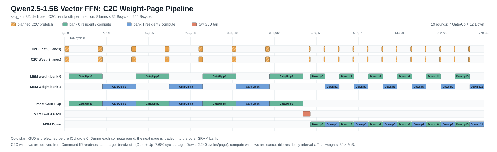

# Qwen C2C 权重双缓冲部署



上图将计算 Command IR 中的权重页 `ready/release/bank` 区间与目标配置的 C2C
带宽放在同一时间轴。实色块是当前可执行文件的 MEM 驻留和 MXM/VXM 计算窗口；
斜纹块先按每方向 8 条外部 lane、每 lane 32 bytes/cycle 推导 C2C 预取窗口，
再受 target 中 DDR 源端带宽的限制。
第 0 页在 ICU cycle 0 前冷启动加载，后续页面在当前 bank 计算时写入另一 bank。

## 目标

Qwen decoder 层不再要求全部权重同时常驻片上 MEM。runtime 首先通过 C2C 将第 0 层已经量化、并按目标 SRAM 布局打包的权重写入 bank 0。计算第 `i` 层时，MXM 从当前 bank 读取权重；C2C 同时把第 `i+1` 层写入另一 bank。层结束后仅在下一页尚未 ready 时等待，然后交换 bank。

这也是整个模型的外部 I/O 规则：host 只能初始化或读取外部 DDR backing store，
不能直接修改 LPU MEM。输入、输出、resident 常量、state 初始化和所有权重页都要
经过 C2C；decoder 层之间的 device-resident alias 属于 LPU 内部数据，不跨外部边界。

## 物理语义

- 每个 MEM slice 有 2 个独立单端口 SRAM bank。
- MEM ICU queue 唯一标识 `(hemisphere, slice, bank)`。
- SRAM 地址是 bank-local row，每 row 为 32 bytes。每 superlane 128 KiB 的配置包含两个 64 KiB bank，因此每个 bank 的地址范围是 `0..2047`。
- bank 0 read 与 bank 1 write 可以同 cycle 发射；同一 bank 内仍服从单端口约束。
- 计算保持原有 32 条 eastward 和 32 条 westward stream。C2C 对外提供可配置
  的 lane，默认每个方向 8 条，每条每 cycle 搬运一个 32-byte vector，峰值为
  `8 x 32 = 256 bytes/cycle`/方向。
- 当前 `ModelSession` 使用 32 条普通计算 stream 之外的专用 C2C lane。RX 指令携带
  目标 hemisphere/slice/bank/row，由目标 MEM 接收端提交 SRAM；所有字节仍必须来自
  DDR DMA 和 C2C 链路，host 不能直接写 LPU MEM。共享-SR 模式仍可选择，此时 lane
  映射到 `W24..W31`，并由普通 MEM `Write` 消费，但不用于当前细粒度重叠分页。
- C2C page ready 表示最后一个目标 SRAM 写入已经提交，不等同于 DMA 把最后一个 vector 放入 RX FIFO。

## 软件表示

Binary v24 在 target ABI 中保存 bank 和外部存储参数。ModelPackage v5 用 `ModelWeightPage` 描述层号、目标 bank、target-packed tensor，以及每个物理 segment 的 DDR offset、半球、slice、row、vector 数和 stream。

只有 `TargetPackedSramVectors` tensor 可以作为 C2C page image。`ftlpu-pack-model-weights` 根据 executable binding 把已经量化的 row-major 权重离线重排成目标 SRAM row image；runtime 只负责搬运，不在部署时重新排列大权重。

当权重物理布局超过目标的 bank 行数时，编译器会自动启用分页。`ftlpu-opt --weight-bank 0|1` 只用于覆盖初始 bank。bank 和 page metadata 从 Tensor IR 起参与物理规划，而不是在 Command IR 上后贴标签。

### 专用 Slice 角色

128 KiB Vector 部署目标 `cmodel_128kb_superlane_vector.json` 将每个 52-slice 半球划分为：
激活/工作区 slices `0..19`，以及靠近 MXM 的权重 slices `20..51`。
其中 `0..15` 构成 SXM 所需的 distributed-16 激活平面，`16..19` 是辅助激活工作区。
MXM accumulator 位于功能单元内部，其容量由 `mxm_accumulator_blocks` 描述；任何 MEM slice 都不配置成 accumulator。
两个 SRAM bank 使用相同的 slice 角色。feedback RMSNorm 将每层 gamma 放在激活区
两个 slice，每个半球只用两条低编号 west stream，其他数据流也保持在 `W16`
以下；pager 使用独立的专用 C2C lane，并写入高编号权重 slice。stream 和 slice/port
的双重资源隔离允许权重预取与 RMSNorm 重叠；两条路径都不能绕过 C2C 外部边界。

该分区消除的是传输和端口冲突，并不会增加容量。对于 seq_len=32 的
Qwen2.5-1.5B FFN，通用 Vector planner 使用四组 8-slice 权重平面：Gate 与 Up
共享 7 个乒乓页，Down 使用 12 个页，每页都不超过每 bank 2048 行。
现有 Block8 紧凑分页布局仍是另一条独立可用路径。

## 执行顺序

1. 预取 page 0 到 bank 0，并等待 SRAM commit。
2. 加载 layer 0 ICU 程序。
3. 启动完整 layer 1 权重页到 bank 1 的 C2C DMA。Attention 和 FFN 保持为同一个 executable、同一个权重页，中间不设置分页边界。
4. 同一个 runtime cycle driver 同时推进 chip、DMA 和 DDR。
5. layer 0 完成后确认 page 1 ready；若未完成则只等待剩余搬运。
6. 加载 layer 1 ICU 程序，执行完整 Attention -> FFN，同时启动 page 2 到 bank 0，依次交替。

`ModelSessionStats` 将冷启动和稳态开销分开统计：`weight_page_initial_wait_cycles` 是 page 0 首装等待，`weight_page_boundary_wait_cycles` 是真正的层边界停顿，`weight_page_hidden_prefetches` 统计进入下一层时已经 SRAM-ready 的页面；原有 `weight_page_wait_cycles` 保留为总等待时间。

C2C receive 指令描述一段连续 SRAM row burst。runtime 按目标 slice 将 segment
分配到已配置的 C2C lane，因此指令数量按 segment 数增长，而不是按 32-byte vector
数增长。

## 当前验证

- `c2c_weight_ping_pong_test`：同一 slice 的 bank 0 read 与 bank 1 C2C write 同 cycle 发射，数据逐字节正确。
- `weight_page_planner_test`：两层权重不进入 resident allocator，分别绑定 bank 0 和 bank 1。
- `model_session_c2c_weight_pages_test`：连续执行三个完整 layer invocation，验证 `bank0 -> bank1 -> bank0` 覆盖，并要求两次稳态预取的层边界等待均为 0 cycle。
- `weight_page_builder_test`：bank1 host upload 与离线 page image 逐字节一致，并确认 bank0 未被写入。
- `qwen_weight_page_builder_test`：按 Qwen2.5-1.5B 的 Q/K/V/O、两组 norm、gate/up/down 真实 shape 生成一层 47.625 MiB page，共 176 个连续 C2C segment，且所有 row 均位于单个 32768-row bank 内。
- `qwen2_5_1_5b_paged_weight_layout_test`：从标准 StableHLO lower 到 Tensor/Stream IR，检查 bank、slice、row 范围和 head-dim 128 的 attention weight row 公式。
- `build_hf_decoder_stack_paging_test`：检查通用 stack builder 是否编译 bank0/bank1
  两个 variant、将连续层交替绑定到两个 variant，并调用离线 C2C page packing。
- `model_session_c2c_io_test`：把 32x1536 BF16 tensor 经 DDR、C2C 和 MEM 做
  往返，并检查不存在 host/MEM 旁路。
- 真实 Qwen seq_len=32 双层 package 数值通过：49,152 个输出中 6 个容差超限点，
  P99=0.25、MAE=0.06079；外部 upload/download 各 1 次，device alias 1 次，
  device copy 0 次。

部署包转换命令：

```powershell
build-ftlpu-vs2026/runtime/ftlpu-pack-model-weights.exe `
  --input qwen.logical.ftlpum `
  --output qwen.paged.ftlpum `
  --first-bank 0
```

从本地 Hugging Face checkpoint 直接生成两层 Qwen package：

```powershell
python compiler/tools/build_hf_decoder_stack.py `
  --model-dir .cache/hf/Qwen2.5-1.5B `
  --opt build-ftlpu-vs2026/compiler/ftlpu_opt.exe `
  --translate build-ftlpu-vs2026/compiler/ftlpu-translate.exe `
  --stablehlo compiler/examples/qwen2_5_1_5b_decoder_layer/decoder_layer_seq128.stablehlo.mlir `
  --target-config compiler/examples/targets/cmodel_large_sram.json `
  --pack-model-weights build-ftlpu-vs2026/runtime/ftlpu-pack-model-weights.exe `
  --c2c-weight-paging --layer-count 2 --seq-len 128 `
  --output-dir build-ftlpu-vs2026/qwen_two_layer `
  --output build-ftlpu-vs2026/qwen_two_layer/qwen_two_layer.paged.ftlpum
```

该命令使用同一套通用 decoder lowering 编译 bank0/bank1 两个 executable，导入连续
两层 HF 权重并打包为交替 C2C page。`hidden.1` 在两层之间保持 device-resident，不回传
host。数值验证使用 `hf_two_decoder_layers_model_session_test.exe`。

两层数值执行链路已经接通；提供本地 Qwen2.5-1.5B checkpoint 时即可生成并验证，
checkpoint 本身不放入仓库。仍待解决的问题是 seq_len=128 整层 Command IR 的完全
展开和文本打印超过十分钟；部署路径下一步应让 binary emitter 直接消费压缩
Schedule/repeat 表示，避免物化巨型 Command MLIR 文本。

## 性能判断

prefill 的单层计算窗口较长，具备隐藏下一层权重搬运的机会。decode 的 `M=1` 计算窗口很短，若每层都搬入约几十 MiB 权重，通常会受 DDR/C2C 带宽限制。decode 后续需要更高链路带宽、按 projection/weight wave 更细粒度预取，或增加可常驻权重容量；双 bank 只能实现重叠，不能消除带宽下界。

默认 8-lane C2C 每方向峰值为 256 bytes/cycle，但这不是持续源端速率。默认
双通道 DDR4-3200 峰值为 51.2 GB/s，在 500 MHz LPU 下等于 102.4 bytes/cycle；
planner 只按 90% 峰值规划，即 92.16 bytes/cycle。每个读请求的延迟还会在
35..50 cycle 之间变化。当前真实 seq_len=32 双层运行测得 layer boundary page
wait 为 4,750 cycle，因此搬运与计算确实发生了重叠，但还没有被完全隐藏。
