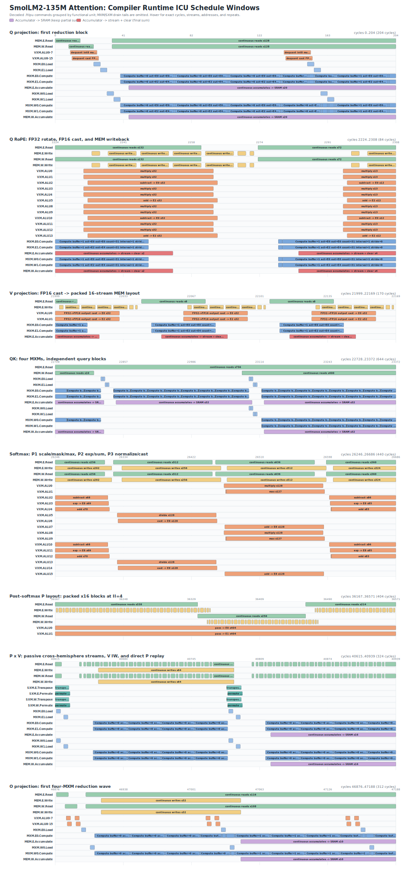

# SmolLM2-135M Attention 流水线



该图由 `compiled_smollm2_attention_softmax_runtime_test` 实际执行的序列化
ICU queue 生成，不是手工维护的时序草图。Runtime 将 `NOP` 和 `Repeat`
command 展开为与 FTLPU-CMODEL 相同的四列 trace：

```text
start,end,resource,detail
```

当前 workload 为 `seq_len=128`、`hidden_size=576`、9 个 query head 和
3 个 KV head，覆盖：

- Q/K/V W8A16 projection 和 Q/K RoPE；
- 四个 MXM 执行的 QK work wave；
- causal mask 融入第一遍计算的三遍流水 softmax；
- SXM probability transpose 和 permutation；
- P x V context 计算；
- 四个 MXM 执行的 output projection。

Runtime test 会将抽样的 Q/K/V 数值、softmax 归一化结果、SXM layout、
P x V context 和最终 O-projection 输出与 CPU reference 对比，并检查所有
抽样的未来 token 概率严格为零。

Causal mask 只保存一个 32x32 tile 中 31 条非零对角线对应的 FP32 vector，
并在所有 query head 和 query block 间复用。完整的过去 block 使用立即数
`0`，完整的未来 block 使用立即数 `-1e9`，只有当前对角 block 读取 mask
vector。Softmax 第一遍执行 `scale -> mask add -> recurrent max`，后两遍直接
使用已经 masked 的 score，不再读取 mask。

## 细节窗口

绘图器采用与 FTLPU-CMODEL
`smollm2_attention_schedule_detail.svg` 相同的功能单元分行方式和配色，
从完整的 69,304-cycle trace 中显示八个便于阅读的窗口：

1. Q projection 的第一个 reduction block；
2. Q RoPE 和写回；
3. V projection 的 16-stream packed write；
4. QK 稳态四 MXM work wave；
5. 三遍流水 softmax；
6. softmax 后的 probability packed layout；
7. P x V 的 SXM transport 和 MXM 计算；
8. O projection 的第一个 reduction wave。

未显式传入 `--window` 时，绘图器会根据 runtime trace 中的算子特征自动
定位这些窗口，因此 scheduler 改变 cycle 后无需同步一张写死的 CModel
cycle 表。仓库中的 PNG 是 SVG 的光栅版本，方便不支持 SVG 的查看器使用。

Scheduler 根据目标模型中的 transport latency 和 queue latency 推导各阶段边界。
Q/K/V 和 O projection 会让每个已加载的权重 tile 连续服务 4 个 32-token
activation tile。在第 4 个 tile 内，activation 临时切换到 stream register
16/17，同时下一权重 tile 完成反量化并加载到另一个 MXM weight buffer。
这样可消除 reduction block 之间的 MXM 空泡，同时保持 accumulator lifetime
不变。QK wave 现在每 280 cycles 启动一次，每个 wave 的实际 lifetime 仍为 301 cycles，
因此下一 wave 的 IW load 会与上一 wave 的 accumulator tail 重叠。东西半球的
softmax 使用独立 VXM ALU bank 并行执行；PV block 根据真实 accumulator 和
context write 尾部推进；probability packing 从 softmax 的实际尾部立即开始；
O projection 的两条 cast 路径也并行执行。Command translation 仍会拒绝同一
ICU queue 上的任何冲突。

Q/K/V 的 final reduction 与稳态 reduction 不同，其 issue interval 有意设为
64 cycles：前 32 cycles 执行 MXM compute，后 32 cycles 用于直接 RoPE/cast
和 packed MEM 写回。Activation planes 占用 slices 32..35，两个 MXM
accumulator 占用 slices 36..43，packed query layout 和 RoPE table 则使用
其余 queue。如果仅间隔 32 cycles 就发射下一 activation tile，会访问仍处于
写回窗口中的 MEM queue。要消除 final-reduction 间隔，需要修改 query 的
物理布局或增加中间 buffer，不能只修改 cycle 数字。

## CModel 实测利用率

下列数据来自完整编译后 Attention binary 的实际执行，并包含 64 个
runtime drain cycles。Monitor 共采样 69,368 cycles，`program.max_cycle`
为 69,304。

| MXM | Active cycles | Array utilization | Active density | Peak active cells |
| --- | ---: | ---: | ---: | ---: |
| MXM0 | 48,210 | 68.64% | 98.77% | 16/16 |
| MXM1 | 27,420 | 38.75% | 98.03% | 16/16 |
| MXM2 | 38,516 | 54.99% | 99.03% | 16/16 |
| MXM3 | 16,678 | 23.62% | 98.24% | 16/16 |
| 四个 MXM 平均 | - | 46.50% | 98.52% | 16/16 |

较高的 active density 表明单个 32-row MXM block 在执行期间能够较好地填满
阵列。较低的全程序利用率以及 MXM0 到 MXM3 的明显差异，主要来自
phase 间空隙和 head/wave 分配不均；MXM3 是最明显的后续调度优化空间。

| 资源 | 全程序利用率 | Active density | Stall rate | Peak |
| --- | ---: | ---: | ---: | ---: |
| VXM ALU | 11.07% | 32.92% | 0.00% | 512/512 |

| SR fabric | Link BW | East BW | West BW | Staged-write util. | Active density | Peak link bytes/cycle |
| --- | ---: | ---: | ---: | ---: | ---: | ---: |
| 东半球 | 4.80% | 5.59% | 4.00% | 5.53% | 4.92% | 6,272/24,576 |
| 西半球 | 3.34% | 3.99% | 2.69% | 3.84% | 4.63% | 6,272/24,576 |

VXM 利用率以每周期 512 个 lane-ALU execution slot 为总容量；SR bandwidth
百分比以模型定义的各半球 SR-fabric 链路容量为分母。VXM stall rate 为零，
说明当前主要问题是调度和 phase occupancy，而不是 lane 级 backpressure。
CModel 目前还没有提供容量归一化的 MEM 或 SXM utilization counter，因此
本文不估算这两项百分比。

## 重新生成

构建 `ftlpu_opt`、`ftlpu_translate` 和
`compiled_smollm2_attention_softmax_runtime_test`，然后运行：

```powershell
python compiler/tests/smollm2_attention_softmax_binary_runtime_test.py `
  --opt build-ftlpu-vs2026/compiler/ftlpu_opt.exe `
  --translate build-ftlpu-vs2026/compiler/ftlpu-translate.exe `
  --runtime-test build-ftlpu-vs2026/runtime/compiled_smollm2_attention_softmax_runtime_test.exe `
  --input compiler/examples/smollm2_135m_attention/attention_seq128.stablehlo.mlir `
  --output-dir build-ftlpu-vs2026/compiler/ftlpu_lower/smollm2_attention_pipeline
```

该命令生成：

- `attention.command.mlir`
- `attention.ftlpu`
- `attention.runtime.csv`
- `attention.pipeline.svg`

使用已有 trace 更新仓库中的文档图片：

```powershell
python compiler/tools/render_attention_pipeline.py `
  build-ftlpu-vs2026/compiler/ftlpu_lower/smollm2_attention_pipeline/attention.runtime.csv `
  compiler/docs/smollm2_attention_pipeline.svg
```

需要检查指定 cycle 范围时，可以重复传入
`--window START:END:TITLE`，覆盖自动语义窗口发现。
