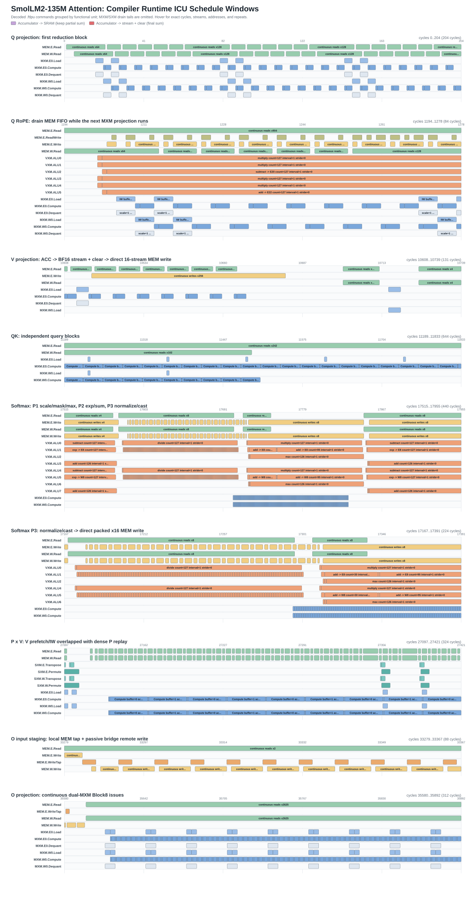

# SmolLM2-135M Attention 流水线



该图由 `compiled_smollm2_attention_runtime_test` 实际执行的序列化
ICU queue 生成，不是手工维护的时序草图。Runtime 将 `NOP` 和 `Repeat`
command 展开为与 FTLPU-CMODEL 相同的四列 trace：

```text
start,end,resource,detail
```

当前 workload 为 `seq_len=128`、`hidden_size=576`、9 个 query head 和
3 个 KV head，覆盖：

- Q/K/V W8A16 projection 和 Q/K RoPE；
- 每个半球一个逻辑 MXM 执行 QK work wave；
- causal mask 融入第一遍计算的三遍流水 softmax；
- SXM probability transpose 和 permutation；
- P x V context 计算；
- 每个半球一个逻辑 MXM 执行 output projection。

Runtime test 首先检查 Command IR 中包含 MEM、MXM、VXM 和 SXM queue
command，再将 binary 交给 runtime 和 CModel 执行。抽样的 Q/K/V 数值、
causal softmax 概率、P x V context 和最终 O-projection 输出都会与独立
CPU Attention reference 对比。CPU reference 只使用上传的输入和权重计算，
不会读取 CModel 中间结果；所有抽样的未来 token 概率还必须严格为零。

Causal mask 只保存一个 32x32 tile 中 31 条非零对角线对应的 FP32 vector，
并在所有 query head 和 query block 间复用。完整的过去 block 使用立即数
`0`，完整的未来 block 使用立即数 `-1e9`，只有当前对角 block 读取 mask
vector。Softmax 第一遍执行 `scale -> mask add -> recurrent max`，后两遍直接
使用已经 masked 的 score，不再读取 mask。

## 细节窗口

绘图器采用与 FTLPU-CMODEL
`smollm2_attention_schedule_detail.svg` 相同的功能单元分行方式和配色，
从完整的 38,215-cycle trace 中显示九个便于阅读的窗口：

1. Q projection 的第一个 reduction block；
2. Q RoPE 从 MEM FIFO 排水，同时下一段 MXM projection 继续执行；
3. V projection 的 16-stream packed write；
4. QK 稳态双半球 work wave；
5. 三遍流水 softmax；
6. softmax 第三遍直接写 probability packed layout；
7. P x V 的 SXM transport 和 MXM 计算；
8. O projection 输入经本地 MEM tap 和 passive bridge 完成 staging；
9. O projection 的第一个 reduction wave。

未显式传入 `--window` 时，绘图器会根据 runtime trace 中的算子特征自动
定位这些窗口，因此 scheduler 改变 cycle 后无需同步一张写死的 CModel
cycle 表。仓库中的 PNG 是 SVG 的光栅版本，方便不支持 SVG 的查看器使用。

Scheduler 根据目标模型中的 transport latency 和 queue latency 推导各阶段边界。
Q/K/V 和 O projection 会让每个已加载的权重 tile 连续服务 4 个 32-token
activation tile。两个独立的 32-column 输出分别占用两个 weight buffer，并以
4-cycle Block8 issue 交错执行。activation 使用 streams 16..31，8 条 INT8 stream
同时送入 MXM 本地反量化和 IW。下一 reduction 采用 wavefront IW：上一条 compute
消费 column 0 后才覆盖 column 0，随后依次覆盖 columns 1..3。这样既能消除
reduction block 之间的 MXM 空泡，也不会覆盖仍在流水线中的权重。QK wave 现在每 280 cycles 启动一次，每个 wave 的实际 lifetime 仍为 301 cycles，
因此下一 wave 的 IW load 会与上一 wave 的 accumulator tail 重叠。东西半球的
softmax 使用独立 VXM ALU bank 并行执行；PV block 根据真实 accumulator 和
context write 尾部推进；softmax 第三遍把唯一的物理结果直接写入 packed
distributed16 probability layout。Command translation 仍会拒绝同一 ICU queue
上的任何冲突。

final reduction 不再执行独立 accumulator-read tail。最后一个 Block8 partial
设置 `accumulator_destination = stream` 和 `accumulator_clear = true`，MXM 在
输出时把完成的 FP32 累加结果转换为 BF16。Q/K/V 将 MXM 的 16 条 westbound
BF16 byte stream 直接写入 MEM，其中 Q/K 先进入专用的 16-slice FIFO。两个
32-column half 采用相差两个 slice 的循环映射，使 RoPE 每个 cycle 读取的一对
BF16 操作数落在四个不同的单读端口 slice 上。RoPE 以每 cycle 一个 token 的速率，
经 west streams 32..43 从 FIFO 排水，并通过不与 MXM 权重/激活流冲突的 east
streams 20..23 写入最终 Q/K placement；与此同时下一段 projection 继续占用 MXM。
Query RoPE 直接把输出半球设置为对应 KV head 所在半球，因此不再需要 projection
完成后的 VXM pass。同一 projection pair 中若两个 Q head 归属同一个 KV 半球，
只在该目标半球上串行两个 128-cycle RoPE drain；目标半球不同时仍然并行。
V 直接写入 packed distributed16 placement。O projection 的输入 staging
不再使用 VXM pass：PV context 放在高位 MEM slice，已经结束生命周期的 RoPE
FIFO slice 复用于 distributed16 activation；每条 westbound stream 先执行本地
`write_tap`，再通过 passive hemisphere bridge 跨半球，并由远端 eastbound MEM
write 消费。两个逻辑 MXM 在同一 cycle 发射 O projection Block8 compute；最后
一个 singleton output group 把同一份权重加载到两个 buffer，并在 token block 间
交替使用；下一 output pair 的权重预取与上一 pair 的结果写回重叠。因此从 cycle
35,616 到 38,204，每个 MXM 的相邻 compute issue 都严格相隔 4 cycles。O result
本身已经按 Block8 distributed16 布局分片，因此每个 MXM 将 BF16 stream 直接写入
源半球的 result slice，不再执行冗余 VXM fanout。这些路径也不再执行旧的 FP32
accumulator read 和 cast。Q/K/V+RoPE 阶段由 6,703 cycles 缩短到 5,525 cycles。

PV 不再在第一个 key block 前用完整 read sweep 清零 context accumulator，
也不再在最后一个 key block 后生成独立的 accumulator-read 命令。中间 key-block
partial 保留在 SRAM；最后一个 partial 设置
`accumulator_destination = stream`、`accumulator_clear = true` 和
`accumulator_output_format = bf16`，由 MXM 将完成的 FP32 累加结果直接转换成
BF16，并通过两条字节流写入源半球的 context MEM。PV 不再使用 VXM cast 或
fanout。Value 权重使用 east streams 0..15，probability activation 使用 east
streams 16..17，因此下一块 value 权重可以跨 key block 和 head wave 预取，当前
MXM compute 不必停顿。Direct MEM write 的起点由 target 的
`mxm_first_result_latency()` 推导；O-projection 预取改用 west streams 2..5，
可以与 PV 最后的 west streams 0..1 重叠而不发生 stream-register 冲突。

## CModel 实测利用率

下列数据来自完整编译后 Attention binary 的实际执行，并包含 64 个 runtime
drain cycles。Monitor 共采样 38,279 cycles，`program.max_cycle` 为 38,215。
O projection 双半球并发 compute、singleton 双 weight-buffer 交替、跨 pair 权重
预取和源半球结果写回，相比上一版 41,034-cycle 调度减少 2,819 cycles（6.87%）；
完整优化链相对 52,681-cycle 基线减少 14,466 cycles（27.46%）。

| 资源 | Active queues | Issued queue-cycles | Issue utilization |
| --- | ---: | ---: | ---: |
| MEM | 104/104 | 450,008 | 11.30% |
| MXM load | 2/4 | 4,176 | 2.73% |
| MXM compute | 2/4 | 36,864 | 24.08% |
| MXM 本地反量化 | 2/4 | 3,600 | 2.35% |
| VXM | 14/16 | 46,080 | 7.52% |
| SXM transpose | 2/2 | 864 | 1.13% |
| SXM permute | 2/2 | 1,086 | 1.42% |

Issue utilization 按 CModel 的物理 ICU queue 数量和完整监测周期归一化。
Executable 声明每半球一个逻辑 MXM，并映射到 CModel 四个物理 MXM 中的两个；
若只按两条逻辑 compute queue 计算，MXM compute issue utilization 为 48.16%。
这些数字表示调度的 queue 占用率，不等同于 MAC cell active density。

## 重新生成

构建 `ftlpu_opt`、`ftlpu_translate` 和
`compiled_smollm2_attention_runtime_test`，然后运行：

```powershell
python compiler/tests/smollm2_attention_binary_runtime_test.py `
  --opt build-ftlpu-vs2026/compiler/ftlpu_opt.exe `
  --translate build-ftlpu-vs2026/compiler/ftlpu-translate.exe `
  --runtime-test build-ftlpu-vs2026/runtime/compiled_smollm2_attention_runtime_test.exe `
  --input compiler/examples/smollm2_135m_attention/attention_seq128.stablehlo.mlir `
  --target-config compiler/tests/Inputs/cmodel_block8_1mxm.json `
  --output-dir build-ftlpu-vs2026/compiler/ftlpu_lower/smollm2_attention_pipeline
```

该命令生成：

- `attention.command.mlir`
- `attention.ftlpu`
- `attention.runtime.csv`
- `attention.pipeline.svg`

使用已有 trace 更新仓库中的文档图片：

```powershell
python compiler/tools/render_attention_pipeline.py `
  build-ftlpu-vs2026/compiler/ftlpu_lower/smollm2_attention_pipeline/attention.runtime.csv `
  compiler/docs/smollm2_attention_pipeline.svg
```

需要检查指定 cycle 范围时，可以重复传入
`--window START:END:TITLE`，覆盖自动语义窗口发现。

## 实验性 QK-Softmax 融合

`--attention-schedule fused` 已包含完整的实验 lowering：QK 最后一个
partial 使用 `accumulator_destination = stream` 和
`accumulator_clear = true`，两个 VXM scratch bank 交替消费 QK wave，
softmax 第三遍直接写入 packed probability 布局。

当前 ICU repeat encoder 仍可能跨 QKV 与 fused 区域合并命令，从而违反
passive stream-register staging 约束。因此当前 target 的 fused legality
检查会自动回退到已验证的 Tail 调度。回退 binary 已通过完整 CModel 数值
golden test；实验路径保持隔离，不会改变 Tail 的内存分配和命令生成。
