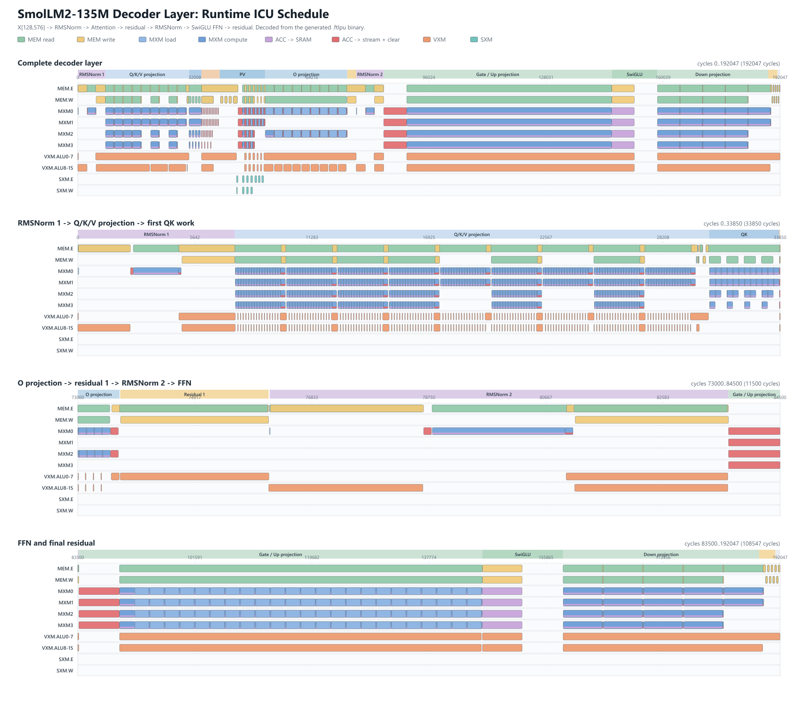

# SmolLM2-135M Decoder Layer 流水图

该图由 `decoder_layer.runtime.csv` 生成。CSV 在 CModel 时钟启动前，直接从编译器
生成的 `.ftlpu` 二进制文件中解码得到。图中按物理功能单元聚合指令，同时分别保留
MEM 读写、MXM load/compute、累加器目的地、VXM 和 SXM 的颜色。SVG 版本可悬停
查看精确周期。

当前 `seq_len=128`、`hidden=576`、`intermediate=1536` 的调度如下：

| 阶段 | 周期范围 |
| --- | ---: |
| RMSNorm 1 | 0..7566 |
| Q/K/V projection | 7566..30429 |
| QK | 30429..33810 |
| Softmax | 33810..38786 |
| PV | 38786..51257 |
| O projection | 51257..73685 |
| Residual 1 | 73695..76125 |
| RMSNorm 2 | 76143..83655 |
| Gate/Up projection | 83655..146032 |
| SwiGLU | 146032..158525 |
| Down projection | 158525..188810 |
| Residual 2 | 188810..191312 |
| 流水排空 | 191312..192047 |

这是正确性优先的基线，不是全局流水化调度。阶段色带能够直观看出当前跨算子串行
边界，并可作为后续 RMSNorm 到 projection、Attention 分块、SwiGLU 到 down
projection、以及 residual 流式融合优化的对照基线。

