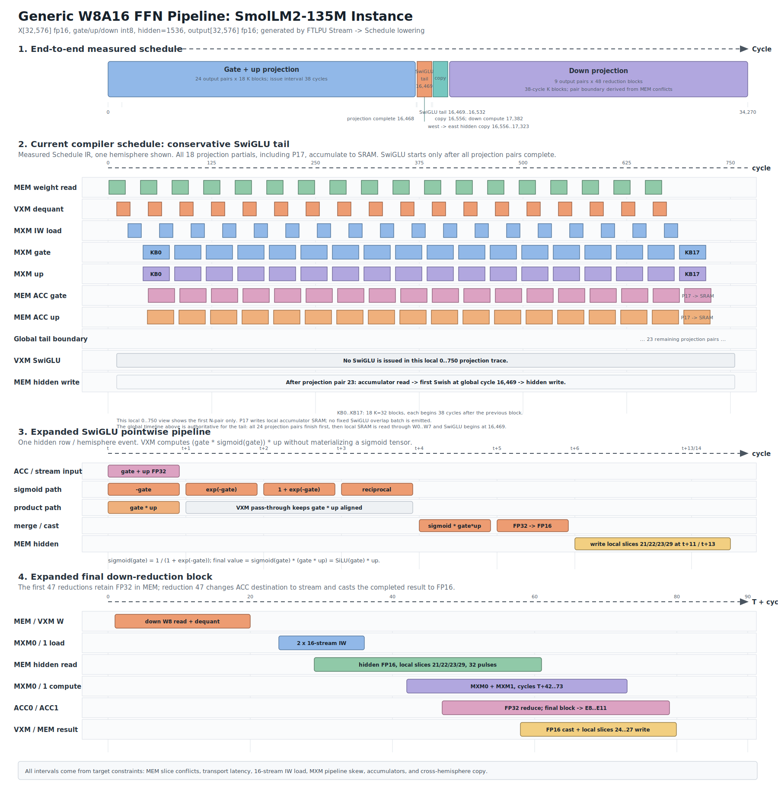
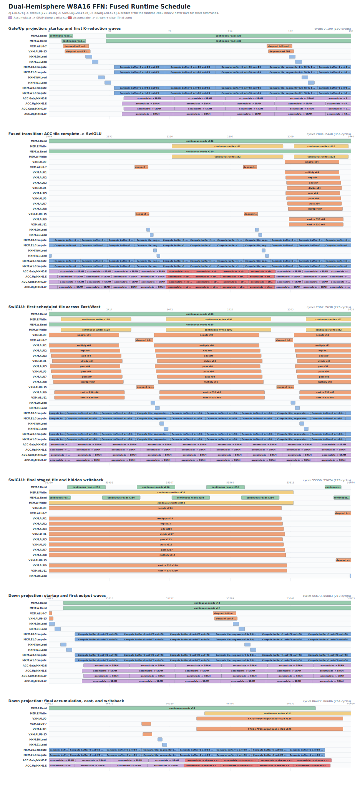
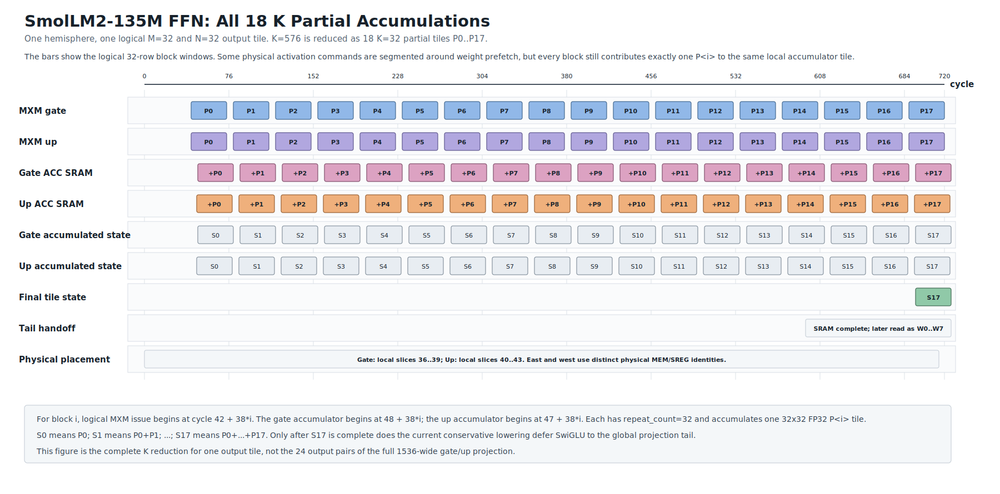

# Generic W8A16 FFN Pipeline: SmolLM2-135M Instance

## Schedule Policies

The compiler keeps two generic schedule policies:

- `--ffn-schedule tail` is the default and preserves the established FFN
  schedule. For `seq_len=128`, its first SwiGLU issue is cycle 55,355 and the
  CModel program ends at cycle 92,573.
- `--ffn-schedule fused` overlaps completed Gate/Up tiles with later
  projection work. Its first SwiGLU issue is cycle 2,363 and the same CModel
  program ends at cycle 86,685, saving 5,888 cycles (6.36%).

The fused policy does not use an unmodeled direct ACC-to-VXM bypass. On the
final K partial, east MXMs use `W8..W15` and west MXMs use `W16..W23`.
`accumulate -> stream + clear` sends the complete FP32 Gate/Up tile to
dedicated ordinary-MEM byte planes: Gate uses local slices `1/5/9/13`, and Up
uses `2/6/10/14`. The VXM allocator reads those planes only after the repeated
MEM write queue is free, skips every four-cycle weight-dequant resource
window, and writes FP16 hidden data through `E30/E31`. ACC-to-MEM transport
includes the fabric's cycle-end commit latency.

Both policies are produced by the same shape-driven lowering. The fused
seq_len=128 binary was executed on the CModel and matched all 73,728 FP16
values against the CPU reference, including 72,633 nonzero outputs.

## Measured CModel Utilization

The following values come from the CModel performance monitors while executing
the compiled `seq_len=128` binaries. The monitor includes the runtime's 64
drain cycles, so it samples 92,637 cycles for tail and 86,749 for fused.
`array utilization` is active MXM cell-cycles divided by all sampled
cell-cycles. `active density` removes completely idle cycles from the
denominator.

| MXM | Active cycles (tail/fused) | Tail array util. | Fused array util. | Tail active density | Fused active density |
| --- | ---: | ---: | ---: | ---: | ---: |
| MXM0 | 86,052 / 86,052 | 92.85% | 99.16% | 99.96% | 99.96% |
| MXM1 | 86,052 / 86,052 | 92.85% | 99.16% | 99.96% | 99.96% |
| MXM2 | 79,902 / 79,902 | 86.22% | 92.07% | 99.96% | 99.96% |
| MXM3 | 79,902 / 79,902 | 86.22% | 92.07% | 99.96% | 99.96% |
| Four-MXM mean | - | 89.54% | 95.62% | 99.96% | 99.96% |

The fused policy performs the same MXM cell work in fewer total cycles. This
raises mean full-program MXM utilization by 6.08 percentage points without
changing the nearly saturated density while an MXM is active.

| Resource | Policy | Full-program util. | Active density | Stall rate | Peak |
| --- | --- | ---: | ---: | ---: | ---: |
| VXM ALUs | tail | 15.91% | 74.19% | 0.00% | 512/512 |
| VXM ALUs | fused | 16.99% | 72.67% | 0.00% | 512/512 |

VXM utilization uses 512 lane-ALU execution slots per cycle as capacity.
Fused scheduling leaves the executed work unchanged but spreads it over 414
more non-idle VXM cycles, so full-program utilization rises while active
density falls slightly.

| SR fabric | Policy | Link BW | East BW | West BW | Staged-write util. | Active density | Peak link bytes/cycle |
| --- | --- | ---: | ---: | ---: | ---: | ---: | ---: |
| East hemisphere | tail | 4.94% | 5.57% | 4.31% | 5.90% | 4.94% | 4,928/24,576 |
| East hemisphere | fused | 5.24% | 5.95% | 4.53% | 6.30% | 5.24% | 6,528/24,576 |
| West hemisphere | tail | 4.57% | 5.11% | 4.03% | 5.47% | 4.91% | 4,928/24,576 |
| West hemisphere | fused | 4.85% | 5.46% | 4.23% | 5.84% | 5.23% | 6,528/24,576 |

SR bandwidth utilization is normalized by each hemisphere's modeled SR-fabric
link capacity, not merely by cycles containing traffic. CModel does not yet expose
capacity-normalized MEM or SXM utilization counters, so those values are not
inferred from the schedule diagram.

Accumulator banks remain on separate rows, while color describes the
operation: purple means `accumulate -> SRAM`, and red means
`accumulate -> stream + clear`.

This is one instantiation of the generic W8A16 FFN lowering implemented by
`ftlpu-stream-to-schedule`. The compiler derives loop counts, physical rows,
slice placement, transport latency, and cycle intervals from the IR shape and
`LPUTargetModel`; it contains no SmolLM2 shape branch.

For this `32x576x1536x576` instance, consecutive K blocks start every 38 cycles
and alternate weight buffers 0/1. Each block issues 32 MXM compute rows, giving
84.2% row-issue occupancy; the remaining six cycles are the modeled MXM
pipeline/control constraint. The last command is issued at cycle 34,270,
compared with 35,743 before projection/SwiGLU overlap and 87,150 before MXM
pipelining.

For `M = 32*T`, the projection loop is `N-tile -> K-tile -> M-tile`. A
`32x32` gate/up weight tile is loaded and dequantized once, then stays in its
MXM weight buffer while it processes all `T` activation tiles. For example,
`seq_len=128` has `T=4`: one weight load is followed by four `M=32` computes
and four independent accumulator address ranges. This is general M tiling,
not a sequence-length-specific path; the `M=32` diagram below is its `T=1`
instance.

All MEM slice numbers in this document are local to one hemisphere. Thus gate
accumulators use local slices 36..39 and up accumulators use local slices
40..43 in both hemispheres. In the CModel's flattened 88-queue view, east
uses queue `local_slice`, while west uses queue `44 + local_slice`.

An MXM weight load uses 16 streams. One MXM compute consumes two FP16
activation streams; the concurrent gate/up MXM pair therefore consumes E0..E3.
A 32x32 K block streams 32 activation rows, with four spatial K=8 contributions
accumulated per output row, and produces one 32x32 partial tile. The 18 partial
tiles for K=576 accumulate in MEM before the completed gate/up tile enters
SwiGLU. When loading block B+1 overlaps block B compute, the activation route
temporarily moves from E0..E3 to E16..E19. Down output-pair transitions are 95
cycles for this placement because result writes and the next weight read both
use local MEM slice 24 in each hemisphere; that interval is calculated from the conflicting slice and
transport latency.

The timeline expands one hemisphere and one `M=32, N=32` output tile. It shows
all `P0..P17` writes into the same gate/up accumulator tile and the resulting
states `S0..S17`; the west hemisphere uses the same cadence with distinct
physical MEM/SREG identities.

The expanded SwiGLU section shows the actual VXM micro-schedule. At cycle `t`,
the two VXM paths start `-gate` and `gate * up`. The sigmoid path then executes
`exp`, add-one, and reciprocal in cycles `t+1..t+3`, while pass-through commands
keep `gate * up` aligned. Cycle `t+4` multiplies both paths, producing
`sigmoid(gate) * (gate * up)`, which is exactly `SiLU(gate) * up`. The result is
cast to FP16 at `t+5` and written to local hidden slices 21/22/23/29 after the modeled
transport and MEM-placement latency.

A single 32x32 MXM weight-tile dequantization takes four issue cycles: the VXM
handles eight columns per cycle. Gate/up on east/west form four independent
weight tiles. They are currently staggered into a 16-cycle aggregate issue
window because all four use the same 16 VXM ALU ICU queues; this is four fast
dequantizations, not one 16-cycle dequantization. Down uses the same continuous
four-cycle dequantization and 16-stream IW load, including weights prefetched
under the previous reduction's final M tile. Activation switches between
`E0/E1` and `E16/E17` only during the actual IW conflict windows.

The second panel uses one continuous time axis for projection completion and
the first SwiGLU work. In the tail figure, all Gate/Up projection pairs finish,
the final partial remains in accumulator SRAM, and `W0..W7` then feed SwiGLU.
In the fused figure, the same panel follows one completed accumulator tile
through `stream + clear`, temporary MEM staging, and SwiGLU while later
projection work remains in flight.

The current tail uses `W0..W7` for accumulator input and local hidden slices
21/22/23/29 for output. It deliberately does not claim projection/SwiGLU
overlap until the scheduler reserves all shared VXM, MEM, stream, and transport
resources at precise cycles.
