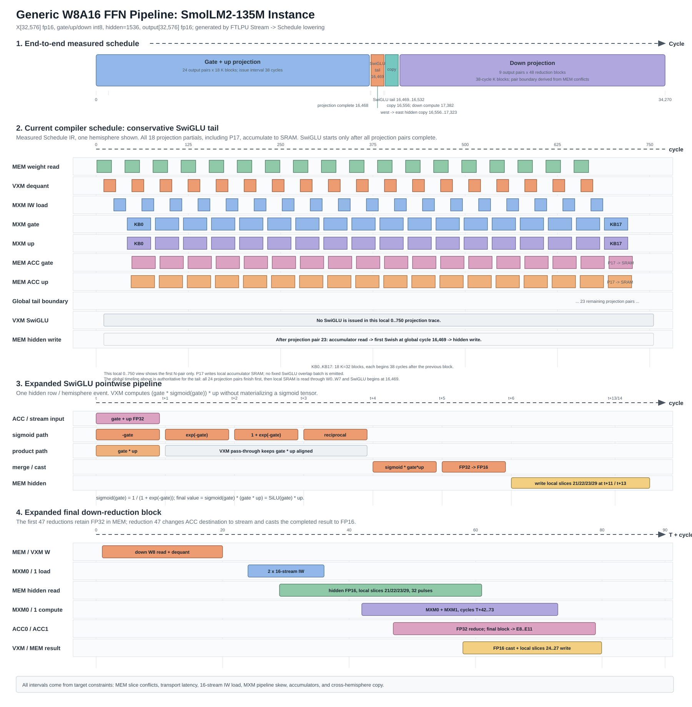
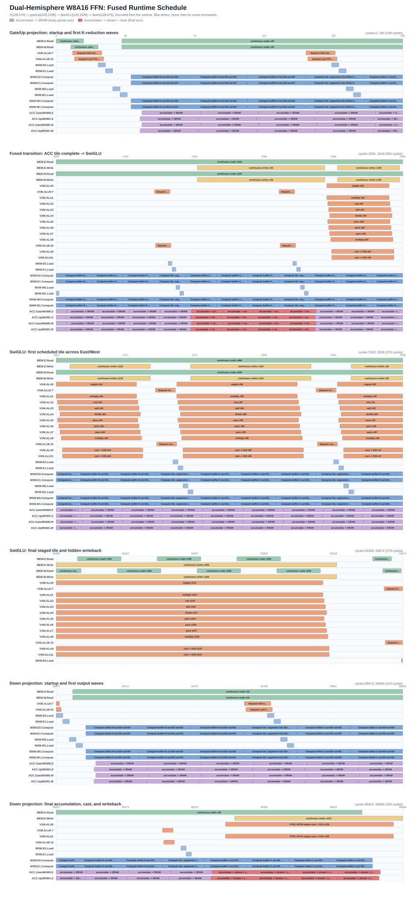
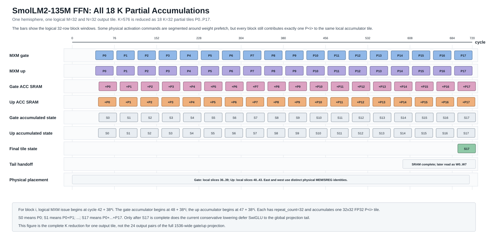

# 通用 W8A16 FFN 流水线：SmolLM2-135M 实例

## 调度策略

默认的 `--mxm-execution auto` 会为当前 BF16 activation、INT8 weight FFN
选择 16-stream Block8 路径。目前有两套经过验证的 Block8 策略：

- `--ffn-schedule tail` 是正确性基线。它先完成全部 Gate/Up projection，
  将每个 pair 写入独立 scratch，再于 cycle 16,574 发射第一条 SwiGLU；
  程序结束于 cycle 33,681。
- `--ffn-schedule fused` 将已完成 Gate/Up pair 的 SwiGLU 与后续 projection
  重叠。stream allocator 根据目标参数预留 projection 实际占用区间，再分配
  不冲突的 VXM-to-MEM route，emitter 中没有固定高位 stream helper。程序结束
  于 cycle 27,425，相对 tail 减少 6,256 cycles（18.57%）。

runtime 包含末尾 64 个 drain cycles，tail 与 fused 分别采样 33,745 和
27,489 cycles。两者的 MEM issue utilization 为 16.89% / 20.74%，MXM
compute issue utilization 为 32.08% / 39.38%，VXM issue utilization 为
23.33% / 28.64%。两套 binary 均与 CPU reference 的 73,728 个 BF16 数值
逐一一致，其中 72,625 个输出非零，最大绝对值为 0.216797。

Tensor lowering 现在为 Gate weight、Up weight 和 Block8 activation 分配三组
互不重叠的物理 slices。因此 planner 可以让 MXM0 Gate load 与 MXM1 Up load
以 4-cycle initiation interval 流水发射，不再让每个 reduction 串行占用 8 cycles。
scratch 只在不同 row address 上复用 weight slices，并显式预约其 queue lifetime。
当前 CModel 的 MXM0 weight 与 activation 仍共用 E0..E15 transport，所以
`mxm_weight_activation_overlap_enabled=0` 会让下一组 load 避开 activation 窗口。
独立 placement 让 tail 和 fused 又各减少 864 cycles；若后续硬件提供独立 transport，
只需在 target 中打开该能力，不需要修改 planner。

legacy MXM 路径仍然保留，但目前对 fused 的请求会回退到 tail，因为被动
stream-fabric transport lifetime 尚未精确建模，编译器还不能证明其分配无冲突。

## 历史 legacy 测量

下表是早期 legacy fused 实验的归档数据，不代表上面的当前 Block8 策略。
统计包含 runtime 末尾的 64 个 drain cycles，因此 tail 共采样
92,637 cycles，fused 共采样 86,749 cycles。`array utilization` 的分母是
全部采样周期内的 MXM cell 容量；`active density` 会从分母中去掉完全空闲的周期。

| MXM | Active cycles（tail/fused） | Tail array util. | Fused array util. | Tail active density | Fused active density |
| --- | ---: | ---: | ---: | ---: | ---: |
| MXM0 | 86,052 / 86,052 | 92.85% | 99.16% | 99.96% | 99.96% |
| MXM1 | 86,052 / 86,052 | 92.85% | 99.16% | 99.96% | 99.96% |
| MXM2 | 79,902 / 79,902 | 86.22% | 92.07% | 99.96% | 99.96% |
| MXM3 | 79,902 / 79,902 | 86.22% | 92.07% | 99.96% | 99.96% |
| 四个 MXM 平均 | - | 89.54% | 95.62% | 99.96% | 99.96% |

fused 与 tail 完成相同的 MXM cell 工作，但总周期更少，因此全程序 MXM 平均
利用率提高了 6.08 个百分点；MXM 一旦开始工作，内部阵列密度仍接近饱和。

| 资源 | 策略 | 全程序利用率 | Active density | Stall rate | Peak |
| --- | --- | ---: | ---: | ---: | ---: |
| VXM ALU | tail | 15.91% | 74.19% | 0.00% | 512/512 |
| VXM ALU | fused | 16.99% | 72.67% | 0.00% | 512/512 |

VXM 利用率以每周期 512 个 lane-ALU execution slot 为总容量。fused 的实际
执行工作量不变，但非空闲 VXM 周期增加了 414 个，因此全程序利用率提高，
active density 略微下降。

| SR fabric | 策略 | Link BW | East BW | West BW | Staged-write util. | Active density | Peak link bytes/cycle |
| --- | --- | ---: | ---: | ---: | ---: | ---: | ---: |
| 东半球 | tail | 4.94% | 5.57% | 4.31% | 5.90% | 4.94% | 4,928/24,576 |
| 东半球 | fused | 5.24% | 5.95% | 4.53% | 6.30% | 5.24% | 6,528/24,576 |
| 西半球 | tail | 4.57% | 5.11% | 4.03% | 5.47% | 4.91% | 4,928/24,576 |
| 西半球 | fused | 4.85% | 5.46% | 4.23% | 5.84% | 5.23% | 6,528/24,576 |

SR bandwidth utilization 的分母是模型定义的各半球 SR-fabric 链路容量，而不是仅统计有
流量的周期。CModel 目前还没有提供容量归一化的 MEM 和 SXM utilization
counter，因此本文不根据流水图推测这两项百分比。

Accumulator bank 仍拆成独立行，颜色表示具体操作：紫色表示
`accumulate -> SRAM`，红色表示 `accumulate -> stream + clear`。

该图是 `ftlpu-stream-to-schedule` 通用 W8A16 FFN lowering 的一个实例。编译器根据
IR shape 和 `LPUTargetModel` 推导循环次数、物理行地址、slice 布局、传输延迟和
cycle 间隔；编译器源码中没有 SmolLM2 尺寸专用分支。

对于 `32x576x1536x576`，相邻 K block 每 38 cycle 启动一次，并交替使用 weight
buffer 0/1。每个 block 连续发射 32 行 MXM compute，行发射占用率为 84.2%；其余
6 cycle 来自已建模的 MXM pipeline/control 约束。最后一条 command 位于 cycle
34,270；projection/SwiGLU 重叠前为 35,743，MXM 流水化前为 87,150。

对于 `M = 32*T`，projection 的循环顺序为 `N-tile -> K-tile -> M-tile`。一个 `32x32` 的 gate/up weight tile 只 load/dequant 一次，随后驻留在 MXM weight buffer 中，依次处理全部 `T` 个 activation tile。以 `seq_len=128` 为例，`T=4`：一次 weight load 后接四次 `M=32` compute，并写入四个互不重叠的 accumulator 地址范围。这是通用的 M tiling，不是 seq_len 专用分支；下图的 `M=32` 只是其 `T=1` 实例。

本文中的 MEM slice 编号均为单个半球内的 local 编号。因此 gate accumulator 在东、西
半球内分别使用 local slice 36..39，up accumulator 分别使用 local slice 40..43。
在 CModel 扁平化的 88 条 MEM queue 视图中，东半球 queue 为 `local_slice`，西半球
queue 为 `44 + local_slice`。

编译器现在为 Gate/Up 保留两条完整执行路径。`legacy` 使用下图所示的双 byte-stream
vector compute；当 BF16 activation、INT8 weight 和目标能力满足约束时，`auto` 会选择
Block8：16 条分布式 activation stream 每次携带 8 行数据，同一组 `E0..E15` 会同时
广播给东西半球的 Gate 和 Up MXM，连续 4 次 Block8 issue 覆盖一个 32 行 token tile。
原始权重通过 8 条 stream 输入，并在各 MXM 内部完成反量化和 IW。

Gate 和 Up 的 `8x32` FP32 block accumulator 不能同时 drain，因为任一路结果都会占满
全部 32 条 west stream。当前保守调度依次 drain 两路结果，转成两组互不重叠的短生命周期
BF16 scratch，再逐行执行 SwiGLU。输入和 hidden 使用两组独立的 16-slice 物理布局，
避免较早完成的 hidden 写回覆盖后续 output wave 仍需读取的输入。SmolLM2-135M 在
`seq_len=128` 下，完整 FFN 从 legacy 的 105,898 cycles 降到 38,968 cycles，且 CModel
数值基线保持一致。相邻 K block 现在通过两个 MXM weight buffer 交替预取：下一块权重
占用当前块最后一个 token tile 前的空闲 issue 窗口，因此两组 repeated Block8 compute
可以首尾相接。

该时间线展开一个半球、一个 `M=32, N=32` output tile。图中完整给出写入同一 gate/up
accumulator tile 的 `P0..P17`，以及累加状态 `S0..S17`；西半球采用相同 cadence，
但使用不同的物理 MEM/SREG identity。

图中展开的 SwiGLU 段就是 Swish 的实际 VXM 微调度。在 cycle `t`，两条 VXM 路径
同时开始计算 `-gate` 和 `gate * up`。sigmoid 路径在 `t+1..t+3` 依次执行 `exp`、
加一和倒数；另一条路径通过 pass-through 保持 `gate * up` 的时序对齐。`t+4` 将
两条路径相乘，得到 `sigmoid(gate) * (gate * up)`，也就是
`SiLU(gate) * up`。结果在 `t+5` 转成 FP16，并在计入传输和 MEM 布局延迟后写入
local hidden slices 21/22/23/29。

单个 32x32 MXM weight tile 的 dequantization 只占用 4 个发射周期：VXM 每周期处理
8 列。Gate/Up 与 East/West 一共形成 4 个独立 weight tile。由于它们共享同一组 16 条
VXM ALU ICU queue，当前排程将四组 dequant 错开发射，合计形成 16-cycle 的发射窗口；
这是四次很快的 dequant，而不是一次 dequant 需要 16 cycles。Down 也使用相同的
连续 4-cycle dequant 和 16-stream IW load，包括与上一个 reduction 最后一个 M tile
重叠的 weight prefetch。Activation 只在实际 IW 冲突窗口内于 `E0/E1` 和
`E16/E17` 之间切换。

第二张图使用一条连续时间轴展示 projection 完成到首个 SwiGLU 的过程。在 tail 图中，
所有 Gate/Up projection pair 完成后，最后一个 partial 保留在 accumulator SRAM，
随后通过 `W0..W7` 送入 SwiGLU。在 fused 图中，同一张图跟踪一个已经完成的
accumulator tile，依次经过 `stream + clear`、临时 MEM staging 和 SwiGLU；与此同时，
后续 projection 仍在执行。

当前 tail 使用 `W0..W7` 读取 accumulator，并写入 local hidden slices 21/22/23/29。
在 scheduler 能够对共享 VXM、MEM、stream 与 transport 资源做精确 cycle 预约前，
该 lowering 不宣称存在 projection/SwiGLU 重叠。
