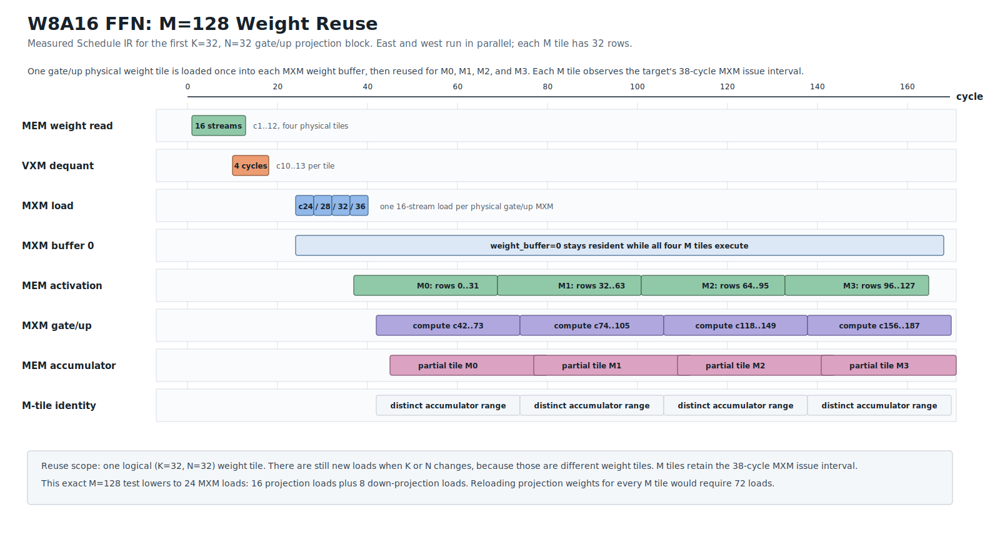

# W8A16 FFN M-Tile Weight Reuse

This is the first `K=32, N=32` projection block from the current
`M=128, K=64, intermediate=128, output=64` Schedule IR regression. The four
physical gate/up MXM weight tiles are loaded once at cycles `24/28/32/36` into
`weight_buffer=0`. They remain resident while the four logical `M=32`
activation tiles start at cycles `42`, `80`, `118`, and `156`. The target's
38-cycle MXM issue interval is retained between M tiles, while the same loaded
weight tile remains resident in `weight_buffer=0`.

The reuse boundary is the logical `(K tile, N tile)`: advancing K or N selects
a different weight tile and therefore needs a new load. Advancing M only
selects another activation tile, so it reuses the resident weight buffer.
