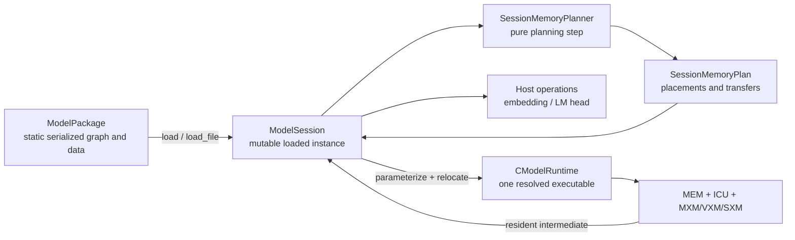
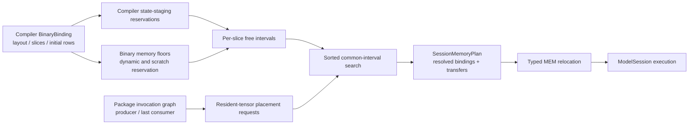

# ModelPackage and ModelSession

`ModelPackage` is the model-level container above an FTLPU command binary. It keeps command binaries reusable instead of statically expanding every decoder layer into one very large ICU program.

## Component boundaries

The model runtime deliberately separates serialized model data, planning, session state, and device execution:

| Component | Lifetime | Owns | Does not own |
| --- | --- | --- | --- |
| `ModelPackage` | Serialized model / loaded package | Named values and tensors, executable templates, invocation order, host operations, persistent-state declarations | Mutable device state or resolved physical addresses |
| `ModelExecutable` | Reusable template inside the package | One `.ftlpu` program, typed bindings, target ABI, relocation records | Per-layer tensor payloads or session lifetimes |
| `SessionMemoryPlanner` | One planning call during `load()` | Producer/consumer lifetimes, resident-tensor placement, state-staging reservations, invocation transfer decisions | State contents, uploads, command execution, or CModel mutation |
| `ModelSession` | One loaded runtime instance | Package copy, memory plan, host values, logical state backing, device-resident value map, statistics, preprocessing and ordered invocation execution | Compiler scheduling or instruction generation |
| `CModelRuntime` | One resolved executable execution at a time | Binding upload/copy, internal initialization, ICU queue loading, ticking and output download | Model-level invocation order or cross-invocation lifetime decisions |



A package can be reused to create multiple independent sessions. A session is the stateful boundary: resident constants are materialized when it is loaded, persistent state survives successive `run()` calls, and loading a new package replaces that state.

## Package contents

The version-6 `.ftlpum` format contains:

- model and architecture identity;
- named constant tensors;
- raw or symmetric INT8 quantization metadata;
- named external and intermediate values;
- typed host embedding lookups used before device dispatch;
- typed host LM-head operations used after device dispatch;
- one or more embedded `.ftlpu` executables;
- typed persistent model states, including per-layer key/value caches;
- an ordered invocation list that maps named values to executable bindings.

The file magic is `FTLPUM01`. Quantized tensor metadata includes encoding, axis, block size, and scales. This metadata is independent of physical SRAM layout; the embedded executable's `BinaryBinding` remains the source of truth for physical placement.

## Model entry preprocessing

Version 3 keeps reading version-1 and version-2 packages. An embedding lookup names an external rank-1 I32 token-id value, a raw rank-2 F16 table, and a rank-2 F16 output. `ModelSession` materializes that output before the first device invocation. This is an explicit host fallback for gather while the LPU ISA has no indirect MEM addressing operation; it is not represented as a fake ICU command.

Version 4 added persistent state and remains readable. Version 6 separates its
logical maximum from the executable's physical SRAM window with
`page_tokens` and `resident_tokens`; older packages are interpreted as fully
resident. An invocation maps a state to an `internal` executable binding
separately from ordinary inputs and outputs.

A host LM head names a rank-2 F16 hidden value, a raw `[vocab, hidden]` F16 weight tensor, and an F16 or F32 logits value. With tied embeddings it references the same `model.embed_tokens.weight` tensor used by the input lookup. The default `last_token_only` mode computes `[1, vocab]` logits after the final LPU invocation, avoiding full prefill-logits materialization.

The staged SmolLM2 flow is therefore:

```text
host embedding -> LPU decoder stack -> LPU final RMSNorm -> host LM head
```

## ModelSession lifecycle and execution

`ModelSession` is the mutable runtime instance for one loaded package. It owns the resolved memory plan and the current host/device value maps; it is not another IR, executable format, or allocator.

### Load phase

`load(ModelPackage)` performs these steps once:

1. validate package structure, bindings, shapes, element types, target ABIs, and invocation references;
2. call `SessionMemoryPlanner::plan` before mutating device memory;
3. replace the previous package, value maps, plan, and statistics;
4. upload every planned resident tensor to its resolved binding;
5. allocate and zero one full logical off-chip backing image per persistent state.

`load_file(path)` reads the package with lazy executable materialization and then follows the same path. Resident weights therefore move during `load()`, not once per layer. Persistent state, including KV cache, is not automatically cleared by `run()`; loading a package initializes its logical backing again.

### External-transfer contract

LPU MEM has no host-visible initialization backdoor. Every resident constant,
persistent-state window, dynamic input, paged weight, and external output
crosses the modeled boundary as
`host backing store -> DDR -> C2C DMA -> C2C -> MEM` or the reverse path.
`Ddr4Model::initialize_vector` and `read_vector` are host accesses to the
external DDR backing store; they never read or write LPU SRAM. A `DeviceAlias`
is still legal between invocations because it preserves an already resident
LPU value and does not cross the external boundary.

The default target models a 500 MHz LPU with dual-channel DDR4-3200: 51.2 GB/s
peak, or 102.4 bytes per LPU cycle. Scheduling uses 90% of peak (46.08 GB/s,
92.16 bytes/cycle). Read latency is 35 cycles plus deterministic 0..15-cycle
jitter; write latency is 25 cycles plus deterministic 0..10-cycle jitter.
Jitter is derived from request ID, address, operation, and a target seed, so
tests are repeatable while requests still complete at different cycles.

Prefetch has no hardware deadline. A page `ready_cycle` in compiler/binary data
is the first logical consumer cycle: a hint for launching prefetch and placing
the synchronization point. Runtime checks the page fence when that consumer is
reached. SRAM-ready requires both C2C RX completion and every target MEM write
to commit. Until then, compute-side ICU issue is held while DDR/C2C continues
to advance on physical clocks; the page-ready event releases compute. DDR
bandwidth and latency jitter therefore become observed runtime stalls instead
of correctness depending on a static prediction.

### Run phase

`set_input(name, bytes)` accepts only values declared as external inputs. `run()` clears the transient device-value map, executes host embedding lookups, runs invocations in package order, and finally executes host LM-head operations. For each invocation it:

1. materializes the executable template and applies scale/MEM relocations from the session plan;
2. pages the invocation's logical K/V resident windows through DDR/C2C into reusable SRAM slots;
3. resets and reloads the CModel ICU queues while preserving MEM SRAM;
4. resolves each input as a resident tensor, dynamic host upload, device alias, or device layout copy;
5. runs the command program and drain cycles;
6. pages updated K/V windows back to off-chip backing;
7. retains device outputs through their last consumer and downloads only external outputs.

`run_invocation(index)` exposes the device-invocation step for focused tests and debugging; it does not replace the package-level preprocessing and postprocessing performed by `run()`. Compatible physical bindings alias directly. Incompatible 16-bit float layouts use a CModel MEM-to-MEM layout transfer without materializing the logical tensor in a host buffer; this explicit backend operation can later become an ICU MEM/SXM adapter executable.

Production activations, RMSNorm parameters, RoPE tables, embeddings, and LM-head boundaries use BF16. Legacy layout names beginning with `Fp16` describe two-byte physical topology only; `BindingElementType::BF16` is authoritative. At executable boundaries, ICU, stream, MXM, VXM, and SXM state is cleared; MEM survives the reset and logical persistent state survives in session backing. `stats()` separately reports state page-in/page-out counts, bytes, and cycles in addition to resident, host, device-copy, and host-operation traffic.

`weight_page_runtime_wait_cycles` counts physical cycles spent at executable
page-ready fences. With execution tracing enabled,
`ModelSession::write_execution_trace_csv()` samples ICU queue state after each
CModel tick and records actual issues, C2C completion intervals, and
`ICU.PageReadyWait`. This is distinct from the static
`write_schedule_trace_csv()` path, which only inspects a binary plan.

## Address planning and relocation

Address planning has three distinct scopes. Compiler Tensor lowering chooses the binding layout, slice set, initial row geometry, operator scratch, and the reusable SRAM staging window for each persistent state; `SessionMemoryPlanner` globally relocates resident constants while reserving those state windows; the Schedule verifier checks cycle-level MEM ports and queues. Logical state contents remain in `ModelSession`'s off-chip backing between invocations. A Schedule conflict check does not replace spatial address-overlap validation.

A `BinaryBinding` fixes target ABI, access class, hemisphere mask, slices, layout, shape, element type, byte size, instruction count, and signed address stride. Runtime relocation preserves all of those fields and changes only `base_row`. For a binding, the occupied half-open row interval is derived as `begin = base_row + min(0, (instruction_count - 1) * address_stride)` and `end = base_row + max(0, (instruction_count - 1) * address_stride) + 1`; this also handles reverse-walking weight commands.

`SessionMemoryPlanner::plan` uses the following deterministic algorithm:

1. Build producer/consumer lifetimes for named values over the ordered invocation list.
2. Key physical memory by `(target_abi, hemisphere, slice)` and verify that executables sharing an ABI agree on row capacity.
3. Reserve `[0, first_free_row)` from binary memory floors for anonymous command scratch, and reserve the exact row interval of every named non-resident binding.
4. Compute the complement of those merged intervals in `[0, capacity)`, record each invocation's compiler-declared state staging binding, and collect immutable tensor inputs for relocation.
5. Sort requests by descending slice count, descending total extent of their slice group, lexicographic slice set, and descending individual extent. This places the most constrained groups first.
6. Generate candidates from each free interval's beginning and `end - extent`. Bindings using at least 16 slices search low rows first; narrower groups search high rows first. A candidate is legal only when the same row interval is free on every referenced physical slice.
7. Carve each resident-tensor interval from every slice and update its resolved `base_row`; state bindings keep their compiler-planned addresses and distinct logical backing names.



After placement, each invocation input is classified independently: `Resident` uses its planned binding, `HostUpload` materializes a dynamic external value, `DeviceAlias` reuses an identical physical binding, and `DeviceCopy` performs an explicit compatible layout transfer. Persistent states are referenced through `BindingAccess::Internal`; sequential states reuse their compiler-declared SRAM staging addresses.

Planning fails instead of silently overlapping memory when capacity is exhausted, no common interval exists across a slice group, executables disagree on target capacity, state bindings disagree on type/layout/shape/slices/hemisphere, a device value crosses target ABIs, or an address move lacks the required relocation. Compiler-side per-function and operator address planning is described in the [compiler architecture document](../../compiler/docs/compiler_architecture.md).

## Internal executable bindings

An executable binding with `access = internal` is physical storage owned by the executable rather than a slot supplied by `ModelSession`. Binary format version 7 gives such bindings a typed initializer and initializer parameters. The runtime currently supports zero-fill, tiled causal-mask generation, and BF16 RoPE cosine/sine table generation. The compiler emits the table shape, physical slices, `theta`, and head dimension; `CModelRuntime::load` materializes the data before ICU clocks start.

This keeps algorithmic constants in the compiler/runtime ABI while avoiding large repeated payloads and test-only SRAM initialization code.

## Real SmolLM2 layer golden

`import_hf_decoder_layer.py` reads a standard Llama-compatible `config.json` and safetensors checkpoint without PyTorch. It extracts any decoder layer, transposes Hugging Face Linear weights to StableHLO layout, applies symmetric per-tensor INT8 quantization, and emits a NumPy reference.

The SmolLM2-135M layer-0, sequence-length-128 test packages:

- the compiled reusable decoder-layer executable;
- real layer-0 Q/K/V/O and gate/up/down weights;
- the two real RMSNorm weights;
- an embedding-derived input and quantized golden output.

The `ModelSession -> ICU -> CModel` result matched all 73,728 BF16 values with maximum absolute error `0.03125` and mean absolute error `0.000815428`.

The test now obtains its RoPE table exclusively from the typed internal binary binding.

## Real two-layer golden

The sequence-length-128 layer-0/layer-1 test uses two independently compiled executables because each layer has different W8A16 scales. `hidden.1` remains resident in CModel MEM between invocations. The decoder always uses the VXM-feedback RMSNorm lowering and `fp16_mxm_distributed_16` as its persistent external-activation ABI. The final residual add writes directly to the same slices and base row expected by the next decoder invocation, so the planner selects a device alias instead of a layout copy.

All layer constants are resident uploads performed by `load()`. A run performs only the dynamic model-input upload, one final host download, one device alias, zero device copies, and no host transfer for `hidden.1`.

## Reusable quantized executables

Binary format version 8 carries typed VXM immediate relocations. A relocation identifies an input binding, quantization scale index, queue, command, and operand. `ModelSession` resolves the invocation's bound `ModelTensor`, copies the executable template, and patches only the declared immediates before loading ICU queues.

Q/K/V/O and gate/up/down weight dequantization therefore share one decoder executable across layers with different per-tensor scales. The real two-layer package shrinks from 50,593,779 bytes with two specialized executables to 29,445,522 bytes with one reusable executable. The shared-executable CModel golden passes with maximum absolute error `0.0625`, mean absolute error `0.00138637`, one device alias, and zero device copies.

`build_hf_decoder_stack.py` extends the same flow to any contiguous HF decoder layer range. It chains each layer's NumPy golden into the next layer input and imports all real layer tensors. By default it reads `num_hidden_layers` from `config.json`.

## Whole-model resident weights

Binary format version 9 carries typed MEM address relocations and the target's physical row capacity. The compiler tags every constant MEM read with its input binding. At package load time, `SessionMemoryPlanner` allocates all decoder weights and RMSNorm parameters globally by target ABI, hemisphere, and slice. The allocator reserves dynamic activation/output regions, sorts constants by extent to limit fragmentation, rejects physical overlap or overflow, and records the resolved binding for each invocation.

For SmolLM2-135M's 30 decoder layers, the current mapping uses five slice-placement executable variants and six layers per variant. The package deduplicates repeated executable paths, so it contains five command binaries, not 30. Its 270 layer constants are uploaded once by `ModelSession::load` and remain in MEM while all 30 invocations execute. A relocated resident binding without a matching command relocation is rejected instead of silently reading the compiler's template address.

## Full-model BF16 prefill golden

The sequence-length-128 SmolLM2-135M prefill test executes host embedding, 30 LPU decoder invocations, LPU final RMSNorm, and the tied host LM head. The package contains five resident-weight decoder variants plus one final-RMSNorm executable. `ModelSession::load` uploads 271 resident tensors once; the decoder chain then uses 28 device aliases and two device layout copies.

The CModel end-to-end golden reports:

- final hidden mean absolute error `0.0304731`;
- final hidden relative L2 error `0.0208004`;
- final hidden cosine similarity `0.999785`;
- LM-head logit cosine similarity `0.999996`;
- identical Top-1 token `178` and complete Top-5 overlap.

The validation combines scale-aware BF16 error, relative L2, cosine similarity, and LM-head Top-K agreement. A fixed absolute threshold alone is misleading for large BF16 activations because one ULP grows with exponent.

`build_hf_decoder_stack.py --checkpoint-outputs` embeds every layer golden,
marks each decoder boundary as an external output, and exposes it as a restart
input. `hf_decoder_stack_checkpoint_test` can therefore start at any layer from
that layer's golden input, which separates a local lowering error from
cumulative BF16 drift. An explicit `ModelSession::set_input("hidden.N", ...)`
overrides the statically planned device alias or device copy for that value and
performs a modeled C2C upload. Packages with complete model boundaries also
carry `golden.final_hidden`, computed by applying the checkpoint's final
RMSNorm to the last decoder golden.

For Qwen2.5-1.5B at sequence length 32, the complete CModel path executes host
embedding, 28 paged decoder invocations, LPU final RMSNorm, and the tied host
LM head. The current real-weight INT8/BF16 measurement reports final-hidden
relative L2 error `0.024953`, cosine similarity `0.999689`, LM-head logit
cosine similarity `0.999307`, and complete Top-5 overlap. The final-hidden
mean absolute error is still reported (`0.054659`) for diagnostics, but is not
an acceptance threshold because it scales with activation magnitude and stack
depth. Strict local BF16 tolerance remains the responsibility of independent
checkpoint-restart tests.

The checkpoint harness derives restart inputs and golden outputs from each
invocation's binding table. By default it restarts every invocation from its
own golden input, so strict BF16 tolerance identifies local lowering errors.
Set `FTLPU_CHECKPOINT_CHAINED=1` to preserve actual outputs across the selected
range and measure cumulative drift. Decoder boundaries and the optional
`final_norm -> final_hidden` boundary use the same mechanism instead of
assuming that every invocation produces another `hidden.N` value.

The full-model executable currently uses FFN tail scheduling. Its static decoder-layer schedule ends at approximately 197,978 cycles versus 192,125 for the fused schedule, so tail is about 3.0% slower in the current scheduler. It is retained here as the conservative full-prefill baseline, not as a performance improvement.

## Layer-paged weight ping-pong

For models whose complete decoder stack cannot remain in MEM, one
`ModelWeightPage` contains all target-packed weights for one complete decoder
layer, including Attention, both RMSNorms, and FFN. Consecutive layer
invocations alternate bank 0 and bank 1. While layer `i` executes from its
bank, the shared C2C/chip cycle driver writes layer `i+1` into the other bank.
Runtime waits only at the next layer boundary when that page is not yet
SRAM-ready.

`weight_page_initial_wait_cycles` reports page-0 bootstrap,
`weight_page_boundary_wait_cycles` reports steady-state stalls, and
`weight_page_hidden_prefetches` reports pages fully hidden by the preceding
layer. Package validation rejects consecutive paged invocations that target
the same bank. The three-layer runtime test covers the full
`bank0 -> bank1 -> bank0` reuse sequence.

## Persistent KV cache

`ModelState.shape` and `max_tokens` describe logical capacity. Version 6 adds
`page_tokens` and `resident_tokens`; the executable internal binding uses
`[resident_tokens, kv_heads, head_dim]`, not the full logical shape.

`SessionMemoryPlanner` reserves compiler-declared state staging slots before it
relocates resident weights. Tensor lowering places persistent K/V windows at
the high end of their slice groups and keeps them live until executable exit;
the planner rejects overlap with any other executable binding. A
session-lifetime resident tensor cannot be placed over these windows either.
Sequential layers reuse the same physical addresses while each state name
keeps independent logical backing. Every invocation is validated for element
type, layout, resident shape, slices, bank, hemisphere placement, binding
index, and target ABI.

`ModelSession::load` zero-initializes each full logical backing once. Before an
invocation it transfers the resident prefix to SRAM through modeled DDR/C2C;
after execution it transfers the updated window back. Runtime CSV traces label
these intervals `C2C.StatePageIn` and `C2C.StatePageOut`. Rank-3 KV shapes are
flattened across their trailing dimensions by the physical layout.

Binary format version 10 adds `BindingAccess` to every MEM address relocation. This disambiguates an input binding and an internal KV binding that use the same numeric index.

For Qwen2.5-1.5B sequence length 32 and capacity 256, all 28 layers have 7 MiB
of logical BF16 K/V state but consume only one 32-token K/V staging pair per
ping-pong bank in SRAM. The current prefill path always transfers the prefix at offset zero.
Decode beyond that window still needs dynamic cache length, page offset,
append ranges, and past-prefix QK/PV scheduling.
