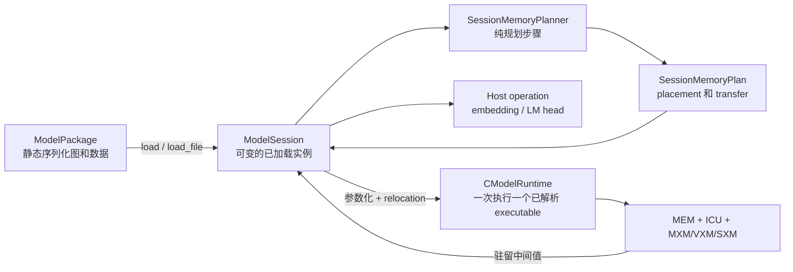
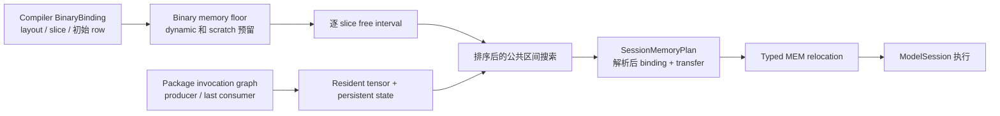

# ModelPackage 与 ModelSession

`ModelPackage` 是位于 FTLPU command binary 之上的模型级容器。它让 decoder layer 的指令可以复用，避免将所有层静态展开成一个巨大的 ICU 程序。

## 组件边界

模型 runtime 明确区分序列化模型、规划结果、session 状态和设备执行：

| 组件 | 生命周期 | 负责 | 不负责 |
| --- | --- | --- | --- |
| `ModelPackage` | 序列化模型或已加载 package | 命名 value/tensor、executable 模板、invocation 顺序、host operation、持久状态声明 | 可变设备状态和最终物理地址 |
| `ModelExecutable` | package 内可复用模板 | 一份 `.ftlpu` program、typed binding、target ABI 和 relocation record | 各层 tensor payload 和 session lifetime |
| `SessionMemoryPlanner` | `load()` 中的一次规划调用 | producer/consumer lifetime、常驻 tensor/state placement、每次 invocation 的 transfer 决策 | 上传、执行 command 或修改 CModel |
| `ModelSession` | 一个已加载的 runtime 实例 | package 副本、memory plan、host value、设备驻留 value map、统计、预处理和顺序执行 | 编译器调度和指令生成 |
| `CModelRuntime` | 每次执行一个已解析 executable | binding 上传/复制、internal 初始化、ICU queue 装载、tick 和结果下载 | 模型级 invocation 顺序和跨 invocation lifetime |



同一个 package 可以创建多个相互独立的 session。session 是有状态边界：load 时物化常驻常量，持久状态跨多次 `run()` 保留；重新加载 package 会替换这些状态。

## 模型包内容

第四版 `.ftlpum` 格式包含：

- 模型名和架构标识；
- 命名常量 tensor；
- raw 或对称 INT8 量化元数据；
- 命名的外部输入、输出和中间值；
- 设备 dispatch 前执行的 typed host embedding lookup；
- 设备 dispatch 后执行的 typed host LM head；
- 一个或多个内嵌 `.ftlpu` executable；
- typed 持久模型状态，包括逐层的 key/value cache；
- 将命名 value 映射到 executable binding 的有序 invocation 列表。

文件 magic 为 `FTLPUM01`。量化 tensor 元数据包括 encoding、axis、block size 和 scale。量化描述不决定物理 SRAM 布局，物理布局仍以内嵌 executable 的 `BinaryBinding` 为准。

## 模型入口预处理

`.ftlpum` v2 增加了 typed embedding lookup。它引用一个外部 rank-1 I32 token-id value、一个 raw rank-2 F16 embedding table，以及一个 rank-2 F16 输出。`ModelSession` 在第一次设备 invocation 前执行 gather。

这是在 LPU ISA 尚未提供 MEM 间接寻址指令时的显式 host fallback，不会伪装成 ICU 指令。v3 reader 仍兼容已有 v1/v2 模型包。

`.ftlpum` v3 增加了 host LM head。它引用 rank-2 F16 hidden、raw `[vocab, hidden]` F16 权重和 F16/F32 logits。对于 tied embedding 模型，LM head 与输入 embedding lookup 直接引用同一个 `model.embed_tokens.weight`，模型包不会复制权重。

默认 `last_token_only` 模式只计算 `[1, vocab]` logits，不物化整个 prefill 序列的 logits。当前阶段执行链为：

```text
host embedding -> LPU decoder stack -> LPU final RMSNorm -> host LM head
```

设备驻留的中间值现在可以被多个后继 invocation 消费，并保持到最后一个 consumer。该 lifetime 语义用于 vocabulary-sharded LM head 等模型级 fan-out。

## ModelSession 生命周期与执行

`ModelSession` 是一个已加载 package 对应的可变 runtime 实例。它持有解析后的 memory plan 和当前 host/device value map；它不是新的 IR、executable 格式或 allocator。

### Load 阶段

`load(ModelPackage)` 只执行一次以下步骤：

1. 校验 package 结构、binding、shape、元素类型、target ABI 和 invocation 引用；
2. 在修改设备内存前调用 `SessionMemoryPlanner::plan`；
3. 替换此前的 package、value map、plan 和统计；
4. 把所有已规划的 resident tensor 上传到解析后的 binding；
5. 为每份 persistent state 分配物理区间并清零一次。

`load_file(path)` 使用 lazy executable materialization 读取 package，随后进入同一流程。因此常驻权重在 `load()` 阶段传输，而不是每层传一次。包括 KV cache 在内的 persistent state 不会被 `run()` 自动清零；重新加载 package 才会再次初始化。

### 外部传输约束

LPU MEM 不提供 host 可见的初始化旁路。所有 resident 常量、persistent state
初始化、动态输入、分页权重和 external output，都必须沿
`host backing store -> DDR -> C2C DMA -> C2C -> MEM` 或反向路径跨越设备边界。
`Ddr4Model::initialize_vector/read_vector` 只是 host 访问外部 DDR backing store
的接口，不会直接读写 LPU SRAM。invocation 之间仍允许 `DeviceAlias`，因为它只是
延长已经驻留在 LPU 内部的数据生命周期，并未跨越外部边界。

默认 target 建模 500 MHz LPU 和双通道 DDR4-3200：峰值 51.2 GB/s，即每个
LPU cycle 102.4 bytes；调度按 90% 峰值规划，即 46.08 GB/s、92.16 bytes/cycle。
读延迟为 35 cycle 加确定性的 0..15 cycle 抖动，写延迟为 25 cycle 加确定性的
0..10 cycle 抖动。抖动由 request ID、地址、读写方向和 target seed 共同决定，
因此不同请求的完成 cycle 不同，同时测试可以稳定复现。

预取没有硬件 deadline。compiler/binary 提供的 page `ready_cycle` 是首个逻辑
consumer cycle，也就是启动预取和放置同步点的提示。runtime 在该 consumer 到达时
检查 page fence；只有 C2C RX 和全部目标 MEM write 都完成才算 SRAM-ready。未完成时
计算侧 ICU 停止发射，DDR/C2C 路径继续推进 physical clock，完成后通过 page-ready
事件恢复计算。这样 DDR 带宽和 latency jitter 直接表现为运行时等待，而不是依赖
静态预测保证正确性。

### Run 阶段

`set_input(name, bytes)` 只接受声明为 external input 的 value。`run()` 会清空临时 device-value map，执行 host embedding lookup，按 package 顺序运行 invocation，最后执行 host LM head。每次 invocation 会：

1. 物化 executable 模板，并根据 session plan 应用 scale/MEM relocation；
2. reset 并重新装载 CModel ICU queue，同时保留 MEM SRAM；
3. 把每个输入解析为 resident tensor、动态 host upload、device alias 或 device layout copy；
4. 执行 command program 和 drain cycle；
5. 让设备输出驻留到最后一个 consumer，仅下载 external output。

`run_invocation(index)` 暴露单次设备 invocation，供定点测试和调试使用；它不能替代 `run()` 完成的 package 级前处理与后处理。物理 binding 兼容时直接 alias；16-bit float layout 不兼容时，在 CModel MEM 内完成 layout transfer，不在 host 中物化完整逻辑 tensor。该显式 backend operation 后续可替换为 ICU MEM/SXM adapter executable。

生产路径中的 activation、RMSNorm 参数、RoPE 表、embedding 和 LM-head 边界使用 BF16。以 `Fp16` 开头的旧 layout 名称只描述双字节物理拓扑，`BindingElementType::BF16` 才是权威数值格式。切换 executable 时会清空 ICU、stream、MXM、VXM 和 SXM 状态，但 MEM 与 persistent state 保持存活。`stats()` 统计 resident upload、state initialization、host transfer、device alias/copy 和 host operation。

`weight_page_runtime_wait_cycles` 统计 executable 内因 page-ready fence 产生的真实
physical-cycle 等待。启用 execution trace 后，
`ModelSession::write_execution_trace_csv()` 从每次 CModel tick 后的 ICU queue 状态
记录实际发射事件、C2C 完成区间与 `ICU.PageReadyWait`；它不同于只读取 binary 的
静态 `write_schedule_trace_csv()`。

## 地址规划与 relocation

地址规划分为三个不同作用域。Compiler Tensor lowering 决定 binding layout、slice 集合、初始 row geometry 和算子 scratch；`SessionMemoryPlanner` 跨 invocation 全局 relocation 常驻常量与 persistent state；Schedule verifier 检查逐 cycle 的 MEM port 和 queue。Schedule 冲突检查不能替代空间地址重叠检查。

`BinaryBinding` 固定 target ABI、access class、hemisphere mask、slice、layout、shape、元素类型、字节数、指令数和有符号 address stride。Runtime relocation 必须保持这些字段不变，只能修改 `base_row`。Binding 占用的半开 row 区间按 `begin = base_row + min(0, (instruction_count - 1) * address_stride)`、`end = base_row + max(0, (instruction_count - 1) * address_stride) + 1` 推导，因此也能覆盖反向遍历 row 的 weight command。

`SessionMemoryPlanner::plan` 使用以下确定性算法：

1. 根据有序 invocation 列表，为命名 value 建立 producer 到最后一个 consumer 的 lifetime。
2. 以 `(target_abi, hemisphere, slice)` 为物理内存 key，并校验共享 ABI 的 executable 对 row capacity 认识一致。
3. 根据 binary memory floor 和 non-resident binding，为每个物理 slice 计算保守的 `reserved_floor`。匿名 command scratch 没有全部枚举为 binding，因此 floor 以下区域都不能分给 resident allocation。
4. 把每个 slice 的初始空闲区间设为 `[reserved_floor, capacity)`，再收集全部 invocation 的 immutable tensor input 和去重后的 persistent state。
5. 依次按 slice 数量降序、同 slice-group 总 extent 降序、slice 集合字典序、单个 extent 降序排列 request，让约束最强的 group 先分配。
6. 从每个 free interval 的 begin 和 `end - extent` 生成候选。使用至少16个 slice 的 binding 从低 row 向高 row 搜索，较窄 group 从高 row 向低 row 搜索；只有同一 row 区间在全部相关物理 slice 上都空闲时才合法。
7. 在每个 slice 上切割选中的 interval，更新解析后的 `base_row`，并记录为 resident tensor 或 persistent-state allocation。



完成 placement 后，每个 invocation input 会独立分类：`Resident` 使用规划后的 binding；`HostUpload` 物化动态 external value；`DeviceAlias` 复用完全相同的物理 binding；`DeviceCopy` 执行显式且兼容的 layout transfer。Persistent state 在整个 session 中只分配一次，并通过 `BindingAccess::Internal` 引用。

容量耗尽、slice group 找不到公共区间、共享 ABI 的 executable 对容量认识不一致、state binding 的 type/layout/shape/slice/hemisphere 不一致、设备 value 跨 target ABI，或者地址移动缺少 relocation 时，planner 会失败，不会静默产生地址重叠。编译器侧的单函数和算子地址规划见[编译器架构文档](../../compiler/docs/compiler_architecture.zh-CN.md)。

## Executable 内部 binding

`access = internal` 的 executable binding 是 executable 自己拥有的物理存储，不是由 `ModelSession` 提供的输入槽位。二进制格式 v7 为它增加了 typed initializer 和初始化参数。目前 runtime 支持清零、分块 causal mask 生成和 BF16 RoPE cosine/sine 表生成。编译器给出表的 shape、物理 slice、`theta` 和 head dimension；`CModelRuntime::load` 会在 ICU 时钟启动前物化这些数据。

这样，算法常量由 compiler/runtime ABI 明确定义，同时不需要在 binary 中反复携带大块常量，也不再需要测试代码手工初始化 SRAM。

## 真实 SmolLM2 单层 Golden

`import_hf_decoder_layer.py` 不依赖 PyTorch，直接读取标准 Llama-compatible `config.json` 和 safetensors checkpoint。它可以抽取任意 decoder layer，将 Hugging Face Linear 权重转置为 StableHLO 使用的布局，执行对称 per-tensor INT8 量化，并生成 NumPy 参考结果。

SmolLM2-135M 第 0 层、`seq_len=128` 测试包包含：

- 编译后的可复用 decoder-layer executable；
- 真实第 0 层 Q/K/V/O 和 gate/up/down 权重；
- 两个真实 RMSNorm 权重；
- 从 embedding 得到的输入和量化 golden 输出。

`ModelSession -> ICU -> CModel` 的 73,728 个 BF16 输出全部完成比较，最大绝对误差为 `0.03125`，平均绝对误差为 `0.000815428`。测试现在完全通过 typed internal binary binding 获得 RoPE 表。

## 真实双层 Golden

`seq_len=128` 的第 0/1 层测试分别编译 executable，因为两层的 W8A16 scale 不同。`hidden.1` 在 invocation 之间保留于 CModel MEM。采用 `vxm_feedback` RMSNorm 策略的 decoder 以 `fp16_mxm_distributed_16` 作为持久化外部激活 ABI。最终 residual add 直接写入下一次 decoder invocation 所需的相同 slices 和 base row，因此 planner 选择 device alias，不再执行 layout copy。

所有层常量都在 `load()` 阶段作为 resident upload 一次性完成。每次 run 只需要动态上传模型输入、最终下载一次结果，并执行一次 device alias、零次 device copy；`hidden.1` 不经过 host。

## 可复用量化 executable

二进制格式 v8 增加 typed VXM immediate relocation。每条 relocation 明确记录输入 binding、量化 scale 下标、queue、command 和 operand。`ModelSession` 根据当前 invocation 绑定的 `ModelTensor` 解析 scale，复制 executable 模板，只修补声明过的 immediate，然后再装载 ICU 队列。

因此 Q/K/V/O 和 gate/up/down 权重反量化可以让不同层共享同一份 decoder executable，即使每层的 per-tensor scale 不同。真实双层模型包从两份专用 executable 的 50,593,779 bytes 降到一份可复用 executable 的 29,445,522 bytes。共享 executable 的 CModel golden 最大绝对误差为 `0.0625`，平均绝对误差为 `0.00138637`，执行一次 device alias、零次 device copy。

`build_hf_decoder_stack.py` 将同一流程扩展到任意连续的 HF decoder 层范围。它把每层 NumPy golden 串成下一层输入并导入所有真实层参数。默认层数直接读取 `config.json` 中的 `num_hidden_layers`。

## 整模型权重驻留

二进制格式 v9 携带 typed MEM 地址 relocation 和 target 的物理 row 容量。编译器为每条常量 MEM read 标记对应的 input binding。加载模型包时，`SessionMemoryPlanner` 按 target ABI、hemisphere 和 slice 对全部 decoder 权重与 RMSNorm 参数做全局物理分配。allocator 会预留动态 activation/output 区域，按占用长度排序常量以减少碎片，并拒绝物理重叠或容量溢出；每个 invocation 都保存最终解析出的 binding。

对于 SmolLM2-135M 的 30 个 decoder layer，当前映射使用 5 个不同 slice-placement 的 executable 变体，每个变体承载 6 层。模型包会去重重复的 executable 路径，因此只保存 5 份 command binary，而不是 30 份。270 个层常量由 `ModelSession::load` 一次性上传并在全部 30 次 invocation 执行期间保留于 MEM。若 resident binding 被移动却没有对应的 command relocation，runtime 会直接拒绝执行，避免静默读取编译模板中的旧地址。

## 完整模型 BF16 Prefill Golden

`seq_len=128` 的 SmolLM2-135M prefill 测试依次执行 host embedding、30 次 LPU decoder invocation、LPU final RMSNorm 和 tied host LM head。模型包包含 5 个驻留权重 decoder executable 变体和 1 个 final RMSNorm executable。`ModelSession::load` 一次性上传 271 个 resident tensor；decoder 链随后使用 28 次 device alias 和 2 次 device layout copy。

CModel 端到端 golden 结果为：

- final hidden 平均绝对误差 `0.0304731`；
- final hidden 相对 L2 误差 `0.0208004`；
- final hidden 余弦相似度 `0.999785`；
- LM-head logits 余弦相似度 `0.999996`；
- Top-1 均为 token `178`，Top-5 完全重合。

验证同时检查按 BF16 数值尺度变化的误差、相对 L2、余弦相似度和 LM-head Top-K 一致性。只使用固定绝对误差阈值并不合适，因为 BF16 激活值越大，一个 ULP 对应的绝对间隔也越大。

使用 `build_hf_decoder_stack.py --checkpoint-outputs` 可以把每层 golden 写入模型包，并把每个 `hidden.N` 标记为外部输出。随后 `hf_decoder_stack_checkpoint_test` 会逐层报告数值漂移，同时不改变正常模型包的 ABI。

完整模型 executable 当前采用 FFN tail 调度。其静态 decoder-layer schedule 结束于约 197,978 cycle，fused 调度约为 192,125 cycle，因此当前 tail 约慢 3.0%。这里保留 tail 作为更保守的完整 prefill 基线，并不把它描述成性能优化。

## 整层权重页乒乓

当完整 decoder stack 无法全部常驻 MEM 时，一个 `ModelWeightPage` 保存一个完整 decoder layer 的全部 target-packed 权重，包括 Attention、两次 RMSNorm 和 FFN。连续 layer invocation 在 bank 0 和 bank 1 之间交替。layer `i` 从当前 bank 计算时，共用的 C2C/chip cycle driver 把 layer `i+1` 写入另一个 bank；只有下一页在层边界仍未 SRAM-ready 时 runtime 才会等待。

`weight_page_initial_wait_cycles` 统计 page 0 冷启动，`weight_page_boundary_wait_cycles` 统计稳态层间停顿，`weight_page_hidden_prefetches` 统计被前一层计算完全隐藏的页面。Package 校验会拒绝连续 paged invocation 使用同一个 bank。三层 runtime 测试覆盖完整的 `bank0 -> bank1 -> bank0` 复用过程。

## 持久 KV cache

`SessionMemoryPlanner` 会把模型状态与常驻权重一起做全局分配。由状态支持的 internal binding 不再计入 executable 的普通 scratch 保留区；它在整个 session 中只分配一个物理区间。每个引用该状态的 invocation 都必须具有相同的元素类型、layout、shape、slice 集合和 hemisphere placement。

`ModelSession::load` 只对每份状态清零一次。切换 executable 时会保留 MEM SRAM，因此后续 prefill layer 和 decode step 能继续观察同一份 cache。对于 `[max_tokens, kv_heads, head_dim]` 这样的 rank-3 KV shape，runtime 会在物理 distributed-matrix layout 中将后两维展平。

`.ftlpu` 二进制格式 v10 为每条 MEM address relocation 增加了 `BindingAccess`。这样，即使 input binding 与 internal KV binding 使用相同数字编号，runtime 也不会把地址修补到错误的命名空间。

当前 52-slice CModel 在两个 hemisphere 合计提供 208 MiB SRAM。SmolLM2-135M 在 8192 token 下的 BF16 KV cache 约为 180 MiB，尚未计入权重和 scratch，因此无法与全部 decoder 权重同时驻留。当前整模型目标使用 2048-token profile；更长上下文需要 paged 或 off-chip KV storage。
